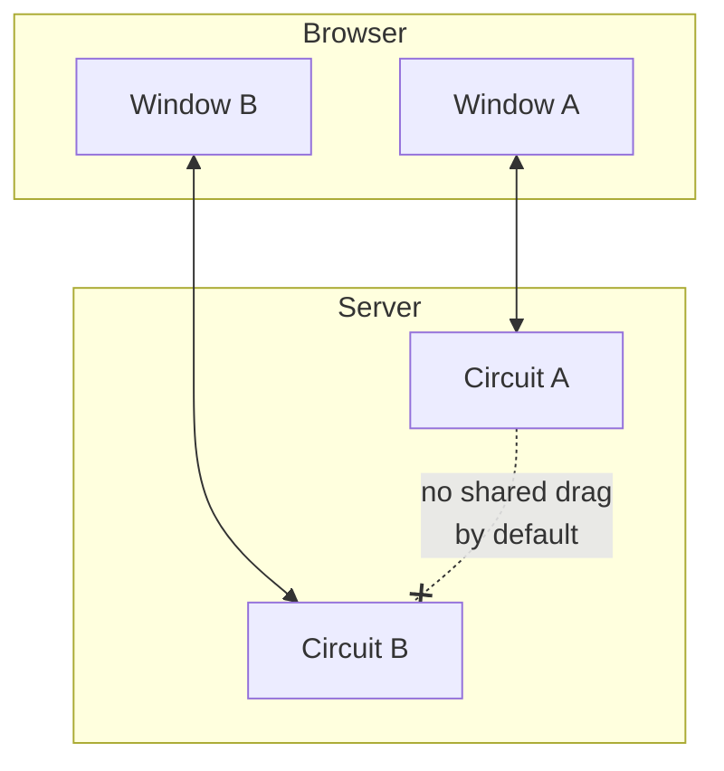
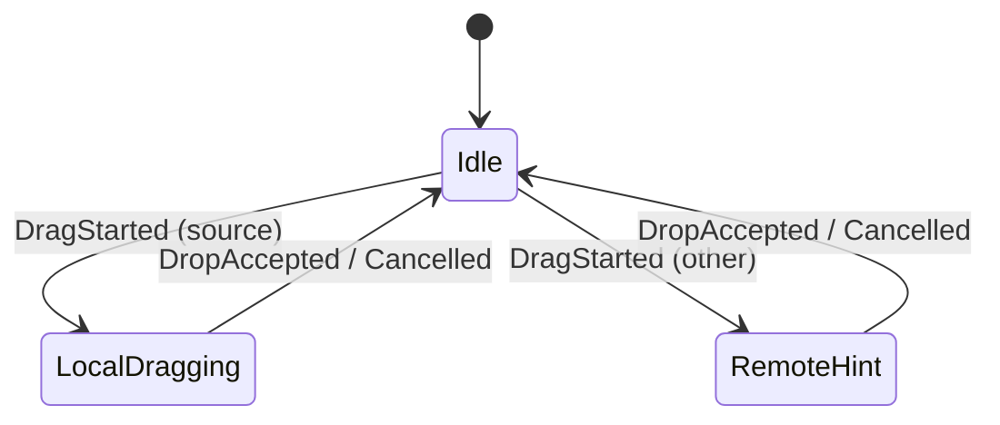
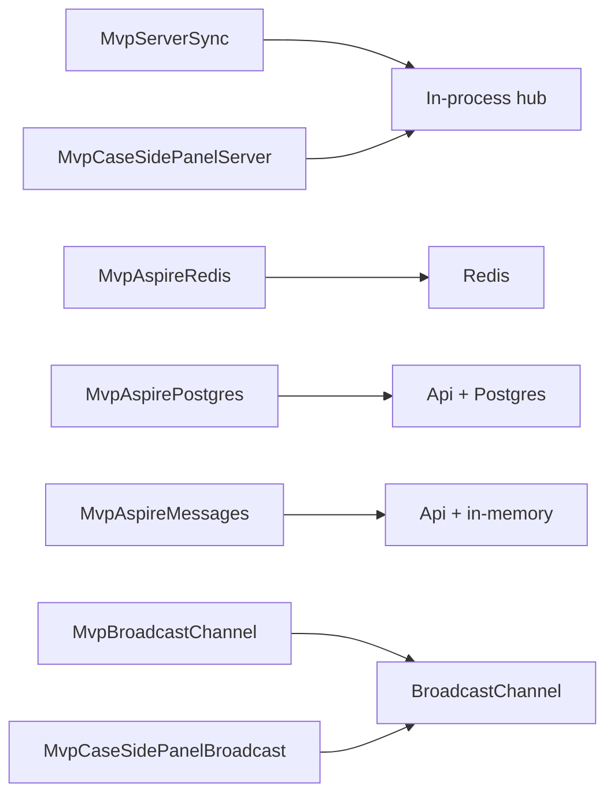
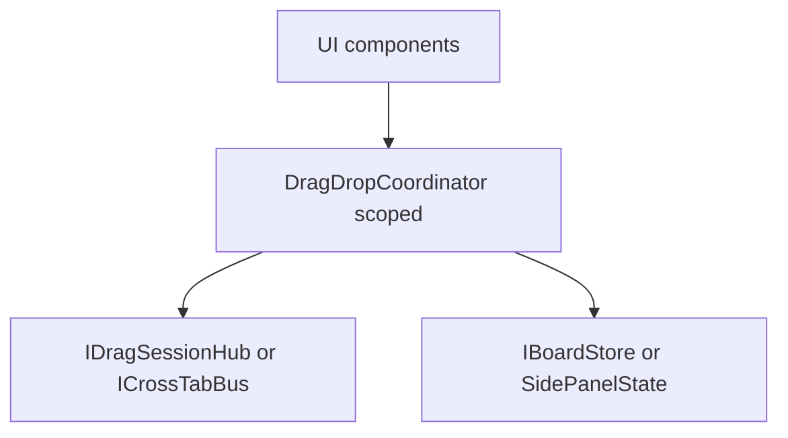
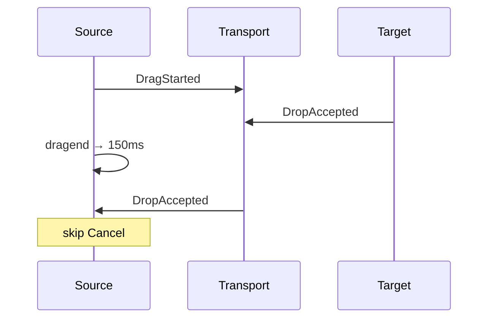
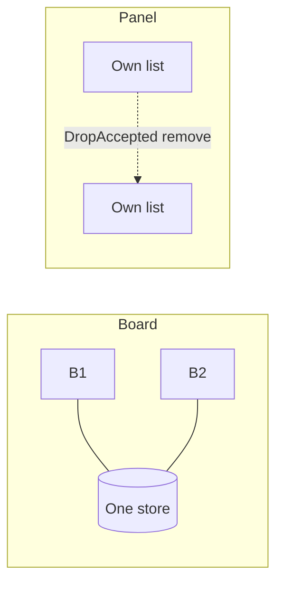
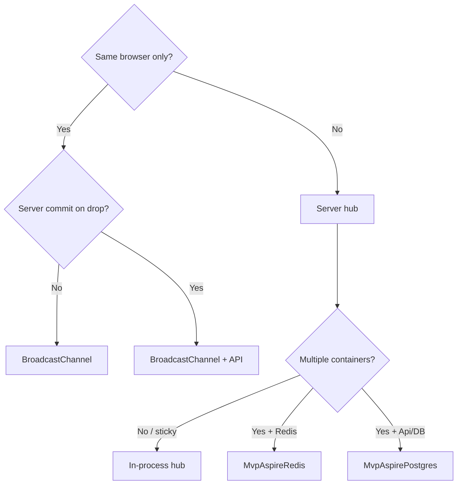
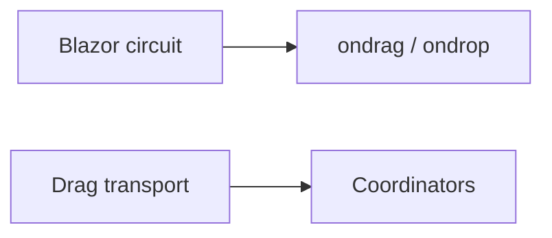

# Cross-window drag-and-drop — guide index

Blazor Server keeps UI state per **circuit**. HTML5 drag runs in the browser. Cross-window drag needs an explicit **session protocol** plus a transport.

**Protocol:** `DragStarted` → `DropAccepted` or `DragCancelled`  
**Demo rule:** two side-by-side **windows** (tabs usually cancel HTML5 drag).

---

## Pick an MVP

| Project | Transport | Shared state | Doc |
| --- | --- | --- | --- |
| [MvpServerSync](./MvpServerSync/) | In-process hub | Shared `BoardStore` | [IMPLEMENTATION](./MvpServerSync/IMPLEMENTATION.md) |
| [MvpBroadcastChannel](./MvpBroadcastChannel/) | `BroadcastChannel` | Per-page board + messages | [IMPLEMENTATION](./MvpBroadcastChannel/IMPLEMENTATION.md) |
| [MvpAspireRedis](./MvpAspireRedis/) | Redis pub/sub | Redis board + sessions | [IMPLEMENTATION](./MvpAspireRedis/IMPLEMENTATION.md) |
| [MvpAspirePostgres](./MvpAspirePostgres/) | HTTP + SignalR → Api | Postgres via Api | [IMPLEMENTATION](./MvpAspirePostgres/IMPLEMENTATION.md) |
| [MvpAspireMessages](./MvpAspireMessages/) | HTTP → Api | In-memory messages | [IMPLEMENTATION](./MvpAspireMessages/IMPLEMENTATION.md) |
| [MvpCaseSidePanelServer](./MvpCaseSidePanelServer/) | In-process hub | Per-window `SidePanelState` | [IMPLEMENTATION](./MvpCaseSidePanelServer/IMPLEMENTATION.md) |
| [MvpCaseSidePanelBroadcast](./MvpCaseSidePanelBroadcast/) | `BroadcastChannel` | Per-window panel | [IMPLEMENTATION](./MvpCaseSidePanelBroadcast/IMPLEMENTATION.md) |

| Pattern | Use when |
| --- | --- |
| In-process hub | Single instance / sticky sessions |
| Redis hub | Multi-replica UI host talks to Redis |
| Postgres Api | Board owned by a backend service |
| Messages Api | List/detail state scenarios (no DB yet) |
| BroadcastChannel | Same browser profile only |

Quick runs and ports: [README.md](./README.md).

---

## Shared building blocks

- **Coordinator** — `LocalDrag` / `RemoteDrag`, 150 ms grace so `DropAccepted` wins over `DragCancelled`.
- **Always** set `Coordinator.Dispatcher = InvokeAsync` before `Start` / `StartAsync`.

**Board vs side panel**

---

## Multi-instance / Azure (decision)

| Approach | Idea |
| --- | --- |
| Sticky / ARR | Keep circuits on one node — short-term only |
| Azure SignalR Service | Scales **circuits**; does not replace shared drag store |
| Redis / Postgres Api | Shared drag + board across UI replicas |
| BroadcastChannel + API | Client hints; authoritative write on drop |

**Do not confuse:** Blazor circuit SignalR (UI) vs drag transport (hub / Redis / Api SignalR / BroadcastChannel).

Circuit drop mid-drag → new scoped coordinator on reconnect; use TTL / cleanup for ghost “Remote drag active.” Details in each MVP doc.

---

## Checklist

1. Same-browser only → BroadcastChannel path; else server hub + shared bus/store.
2. Multi-replica Blazor → Redis or Postgres Api (not in-process hub alone).
3. Authoritative state off process memory.
4. Sticky sessions or Azure SignalR for circuits.
5. Prove with two windows on two instances early (`web-a` / `web-b`).
