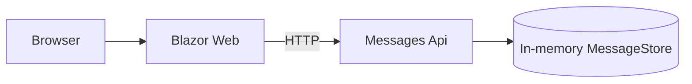
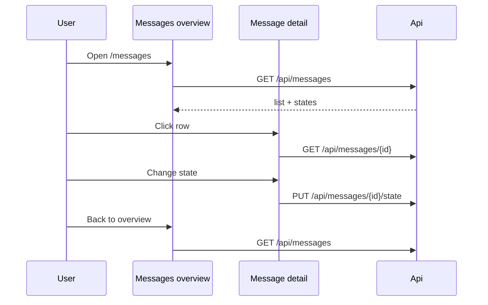

# MvpAspireMessages — implementation notes

## Architecture

## Flow

## States

| Enum | UI label |
| --- | --- |
| `Waiting` | In waiting |
| `Processed` | Processed |
| `Deleted` | Deleted |

Persistence is process-local: restarting the Api reseeds the five sample messages.

## Ports

| Resource | URL |
| --- | --- |
| web | http://127.0.0.1:5300 |
| api | http://127.0.0.1:5305 |
