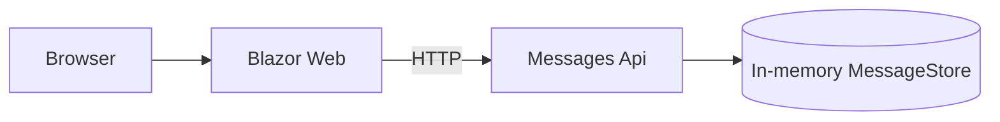
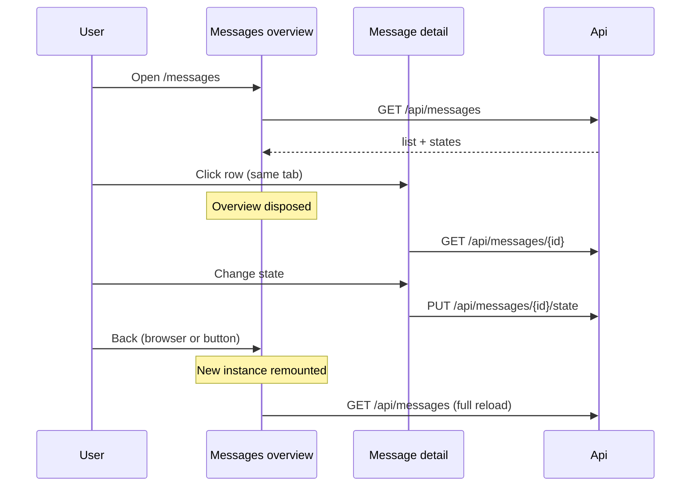
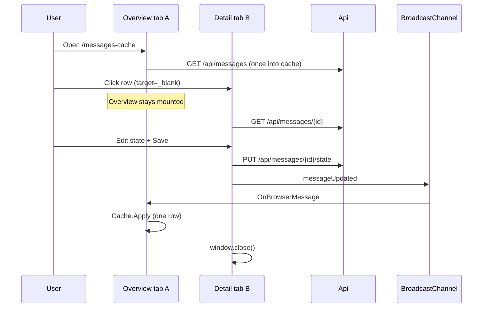
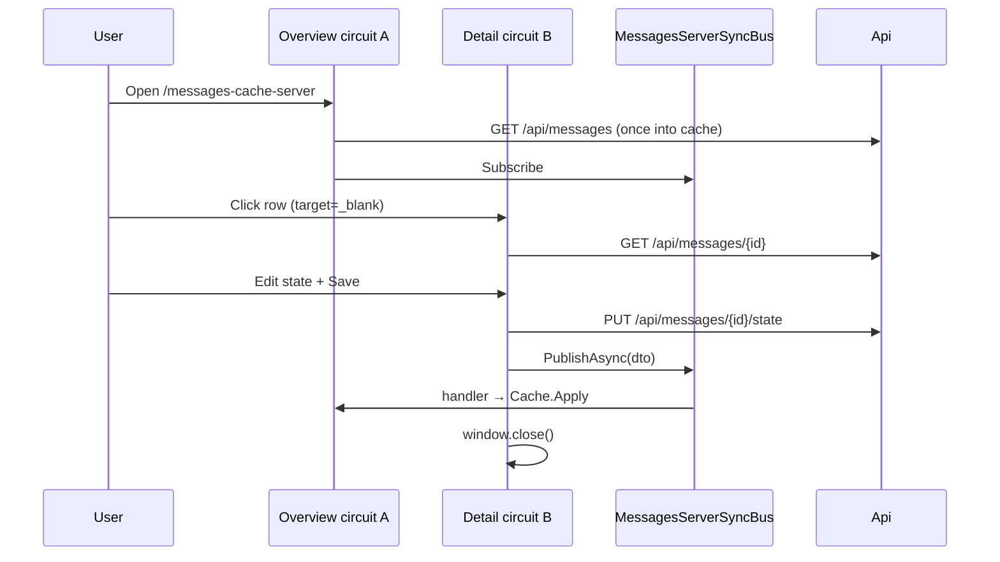

# MvpAspireMessages — implementation notes

For a product-style comparison of the three routes (pros/cons, production replicas, BroadcastChannel vs C# bus), see **[SCENARIOS.md](./SCENARIOS.md)**.

## Architecture

## Scenario 1: `/messages` always full-reloads

When the overview is shown again after navigation away, Blazor creates a **new** `Messages` instance. There is no circuit-scoped list cache on this route, so:

| Return path | What happens |
| --- | --- |
| Browser Back | Remount → `OnInitializedAsync` → `GET /api/messages` |
| **Back to overview** (`NavigateTo`) | Same remount + full list reload |

## Scenario 2: `/messages-cache` — cache + new tab

Overview stays mounted in tab A. Detail is tab B (new circuit). Scoped `MessagesListCache` is **per circuit**, so tab B cannot touch tab A’s cache via DI. After Save, tab B publishes on `BroadcastChannel`; tab A applies `Cache.Apply(dto)`.

| Concern | Approach |
| --- | --- |
| Avoid full list reload | Circuit-scoped `MessagesListCache` |
| Detail in another tab | `target="_blank"` → new Blazor circuit |
| Refresh originating overview | `BroadcastChannel` (same browser profile) |
| Close detail tab | `window.close()` (may be blocked; patch still applied) |

## Scenario 3: `/messages-cache-server` — cache + C# in-process bus

Same UX as scenario 2. After Save, detail calls `MessagesServerSyncBus.PublishAsync` on the **Web** host. Every subscribed overview circuit (any browser tab hitting this Web instance) gets the DTO and patches its cache. No BroadcastChannel; JS only closes the tab.

| Concern | Approach |
| --- | --- |
| Cross-circuit notify | Singleton `MessagesServerSyncBus` on Web |
| Multi-user same host | Yes — any circuit subscribed on this process |
| Multi-node Web | Needs backplane (not in this MVP) |

## States

| Enum | UI label |
| --- | --- |
| `Waiting` | In waiting |
| `Processed` | Processed |
| `Deleted` | Deleted |

Persistence is process-local: restarting the Api reseeds the five sample messages.

## Ports

| Resource | URL |
| --- | --- |
| web | http://127.0.0.1:5300 |
| api | http://127.0.0.1:5305 |
