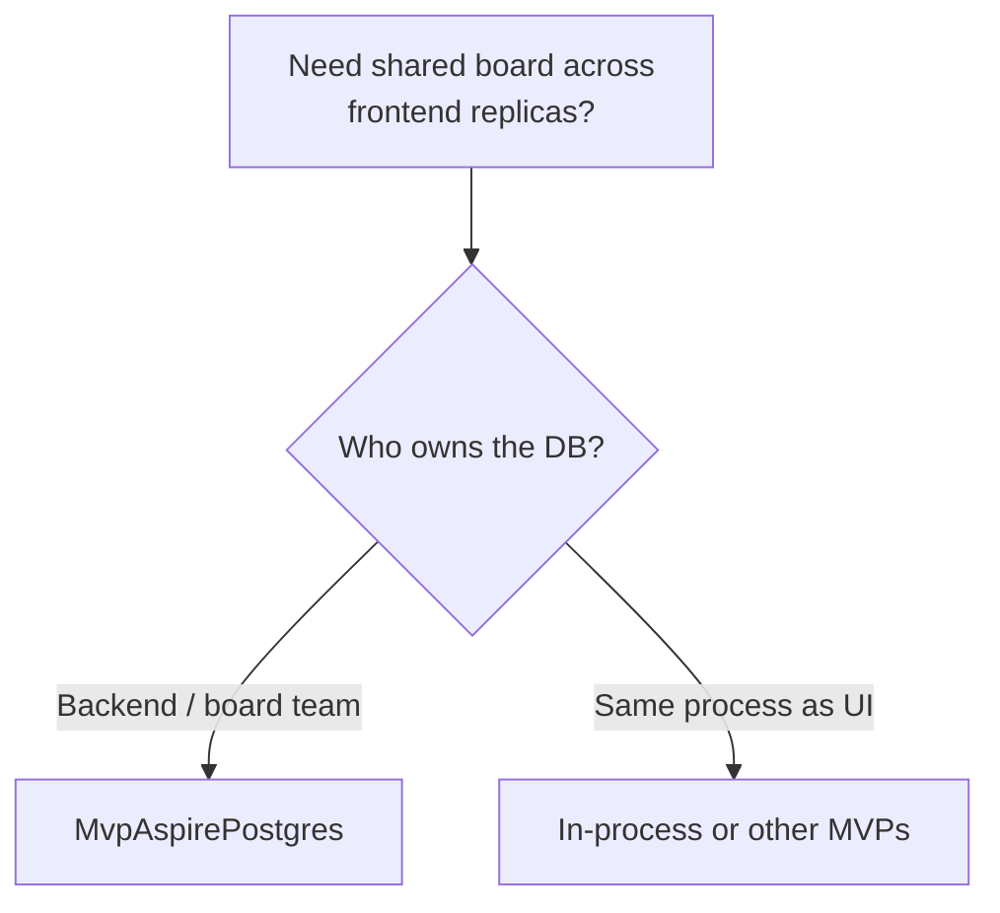
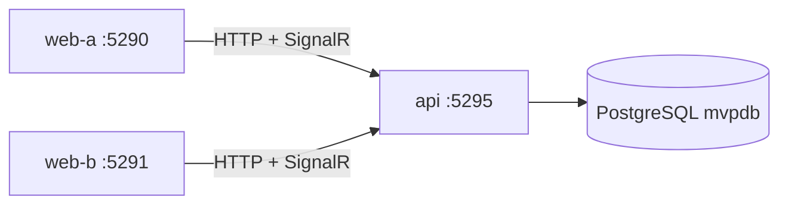
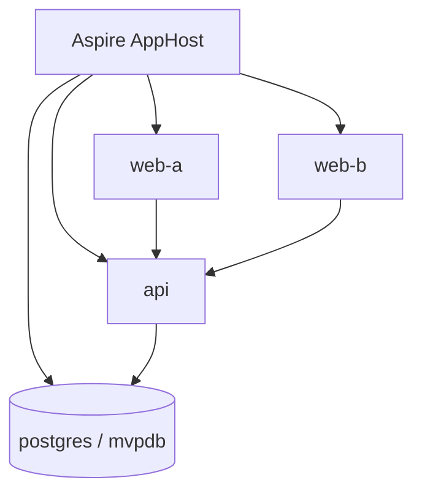
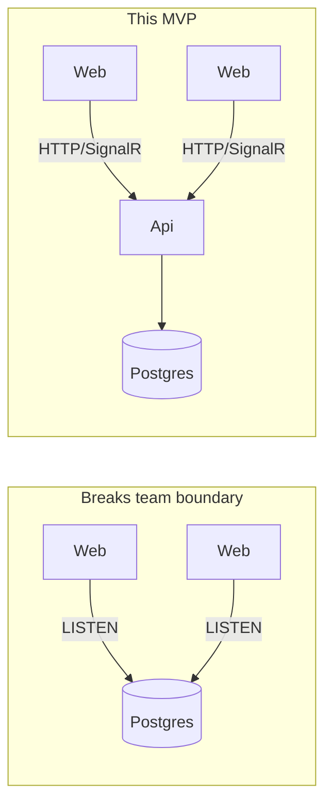
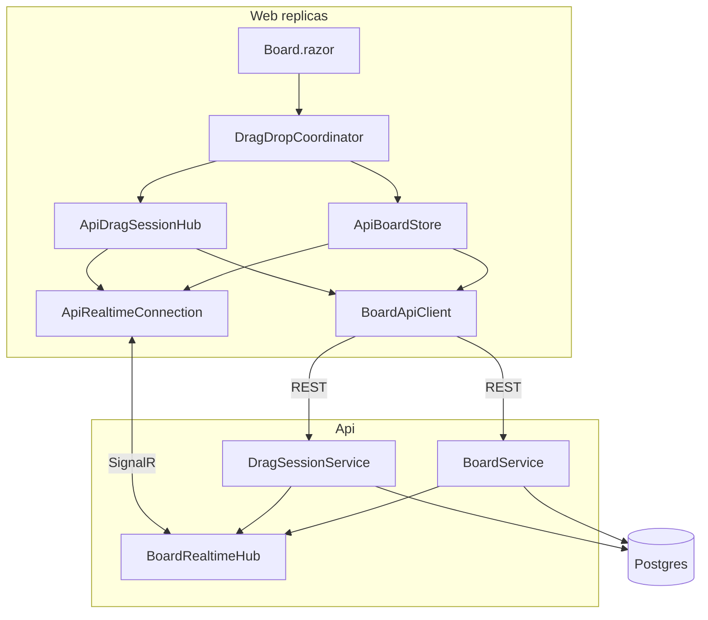
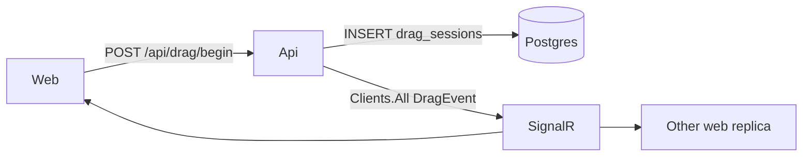
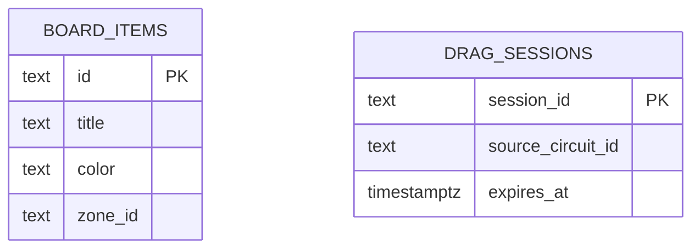
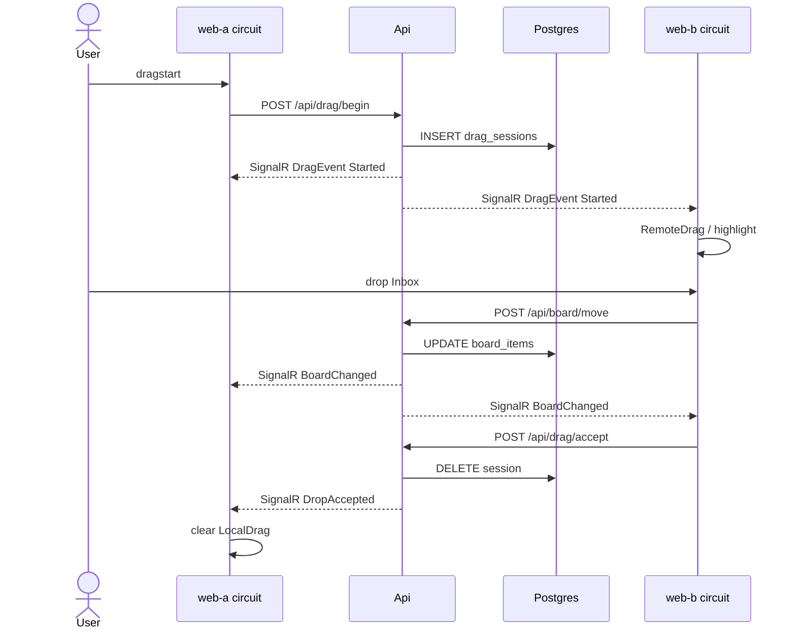
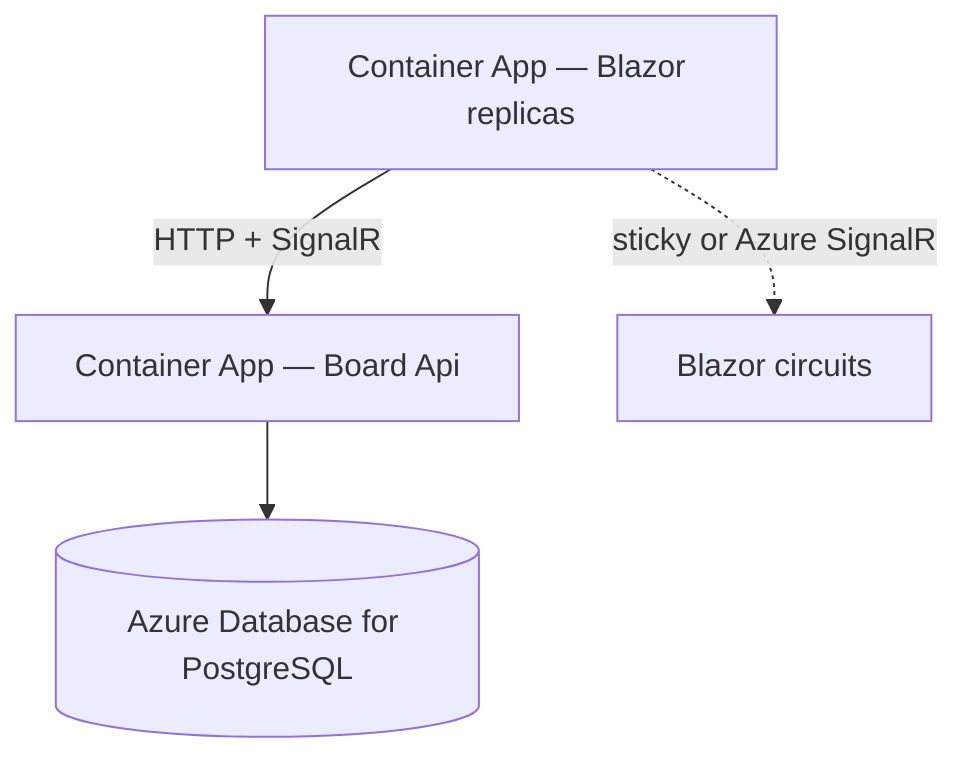
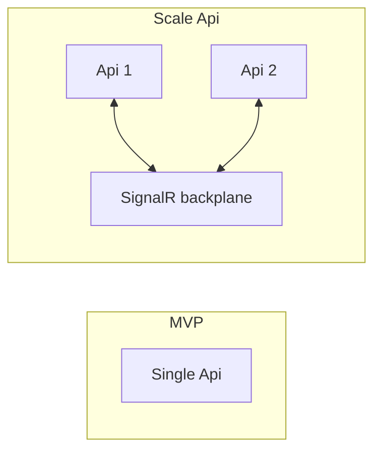

# MvpAspirePostgres — implementation

Shared kanban board with a **backend Api** that owns **PostgreSQL**, plus two Blazor **frontends** that call REST and receive SignalR push. Models “board team owns the service.”

**Run:** `dotnet run --project AppHost` (Docker required)  
**URLs:** web-a http://127.0.0.1:5290/board · web-b http://127.0.0.1:5291/board · api http://127.0.0.1:5295/api/board  
**Quick start:** [README.md](./README.md)

---

## When to use

- Microservices / team boundary: UI must not open the DB.
- Multiple frontend replicas on Azure Container Apps.
- Prefer Postgres you already run for domain data.



---

## Topology





Frontends never take a Postgres connection string. Demo uses **one** Api instance.

---

## Why SignalR on the Api (not LISTEN in Web)



Once the DB is behind a service, only that service should notify. Api persists, then pushes `BoardChanged` / `DragEvent` to all frontends.

---

## What it proves

| Concern | How this MVP handles it |
| --- | --- |
| Board items | Api → table `board_items` |
| Board UI refresh across frontends | SignalR `BoardChanged` |
| Drag events across frontends | SignalR `DragEvent` |
| In-flight drag session | Table `drag_sessions` with `expires_at` (~2 min) |
| Hosting | AppHost: Postgres + **api** + **web-a** + **web-b** |
| Demo URLs | web **5290 / 5291**, api **5295** |

---

## Layers



| Project | Types |
| --- | --- |
| **Api** | `BoardService`, `DragSessionService`, `BoardRealtimeHub`, schema |
| **Web** | `BoardApiClient`, `ApiRealtimeConnection`, `ApiBoardStore`, `ApiDragSessionHub` |

---

## API surface

| Method | Path | Purpose |
| --- | --- | --- |
| GET | `/api/board` | List items |
| POST | `/api/board/move` | `{ itemId, zoneId }` |
| POST | `/api/drag/begin` | Start session |
| POST | `/api/drag/cancel` | Cancel |
| POST | `/api/drag/accept` | Accept drop |
| SignalR | `/hubs/board` | `BoardChanged`, `DragEvent` |



### Schema



---

## End-to-end: drag across frontends



---

## DI

**Api** — register services on the builder, map the hub on the app:

```csharp
builder.AddNpgsqlDataSource("mvpdb");
builder.Services.AddSignalR();
builder.Services.AddSingleton<BoardService>();
builder.Services.AddSingleton<DragSessionService>();

var app = builder.Build();
// ...
app.MapHub<BoardRealtimeHub>("/hubs/board");
```

`MapHub` is a pipeline mapping (like `MapGet`), not a DI registration — it must run on `WebApplication` after `Build()`, which is what `Api/Program.cs` does.

**Web**

```csharp
builder.Services.AddHttpClient<BoardApiClient>(c =>
    c.BaseAddress = new Uri("https+http://api"));

builder.Services.AddSingleton<ApiRealtimeConnection>();
builder.Services.AddHostedService(sp => sp.GetRequiredService<ApiRealtimeConnection>());

builder.Services.AddSingleton<ApiBoardStore>();
builder.Services.AddSingleton<IBoardStore>(sp => sp.GetRequiredService<ApiBoardStore>());
builder.Services.AddHostedService(sp => sp.GetRequiredService<ApiBoardStore>());

builder.Services.AddSingleton<ApiDragSessionHub>();
builder.Services.AddSingleton<IDragSessionHub>(sp => sp.GetRequiredService<ApiDragSessionHub>());
builder.Services.AddHostedService(sp => sp.GetRequiredService<ApiDragSessionHub>());
```

Hosted order: realtime connection first, then store/hub subscribers.

---

## Production / Azure



| Topic | Guidance |
| --- | --- |
| Frontend scale-out | Works with one Api; SignalR fans out to all webs |
| Api scale-out | Needs SignalR backplane (or NOTIFY→hub bridge) between Api replicas |
| Blazor circuits | Sticky sessions or Azure SignalR Service |
| Channel scope | Tenant/workspace in production |
| Cost ballpark | [AZURE-COST-ESTIMATE.md](./AZURE-COST-ESTIMATE.md) — SignalR incremental ≈ €0 (hub on API) or ≈ €45–50/mo (Azure SignalR Standard 1 unit) |



---

## File map

| Path | Role |
| --- | --- |
| `AppHost/AppHost.cs` | Postgres + api + web-a/b |
| `Api/Services/BoardService.cs` | Board + SignalR notify |
| `Api/Services/DragSessionService.cs` | Sessions + SignalR |
| `Api/Hubs/BoardRealtimeHub.cs` | Push hub |
| `Api/Infrastructure/PostgresSchema.cs` | Tables |
| `Web/Services/Api/BoardApiClient.cs` | HTTP |
| `Web/Services/Api/ApiRealtimeConnection.cs` | SignalR client |
| `Web/Services/Board/ApiBoardStore.cs` | `IBoardStore` |
| `Web/Services/DragSession/ApiDragSessionHub.cs` | `IDragSessionHub` |

Index: [../IMPLEMENTATION.md](../IMPLEMENTATION.md)
