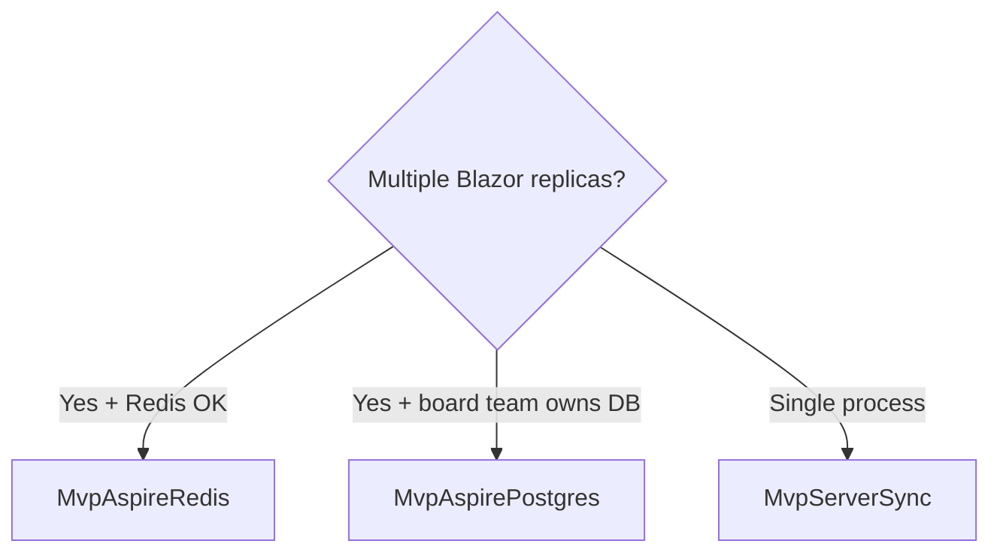
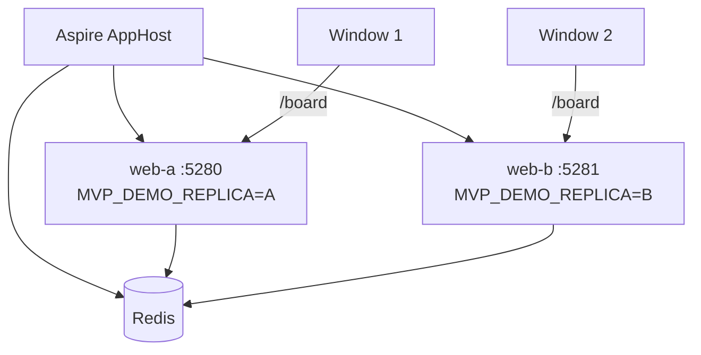
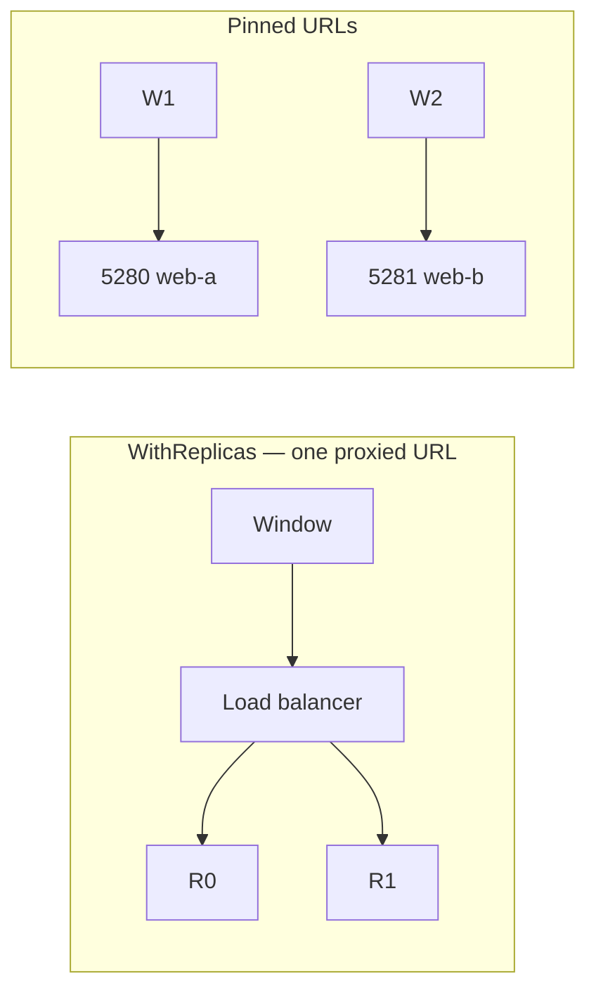
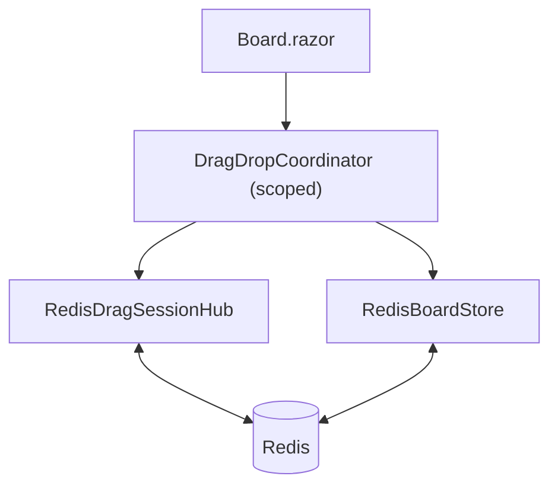
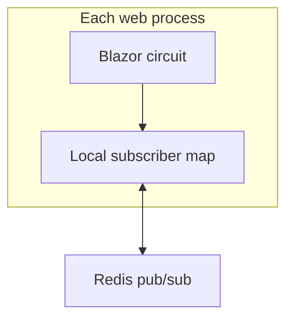
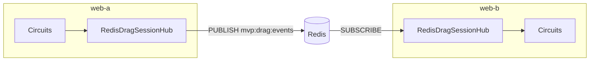
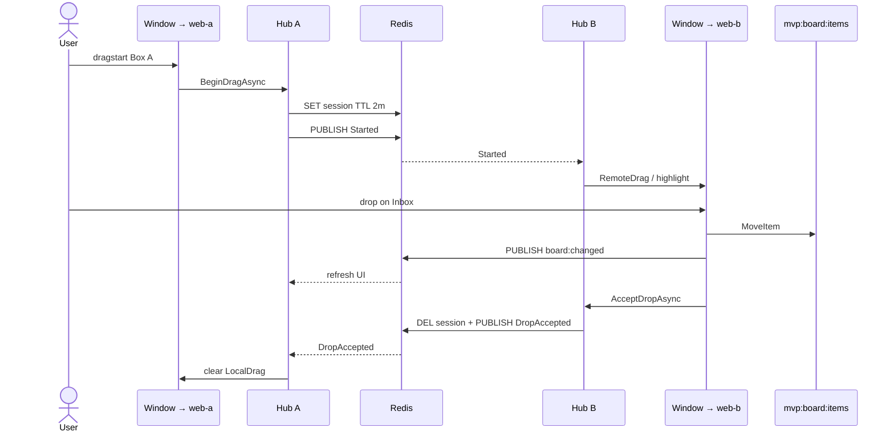
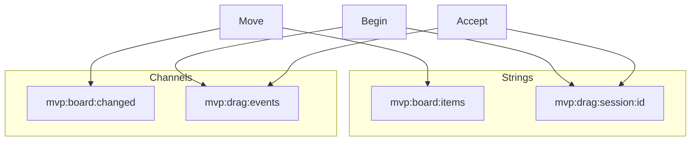
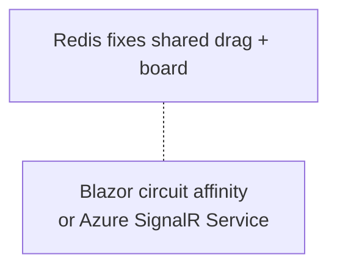
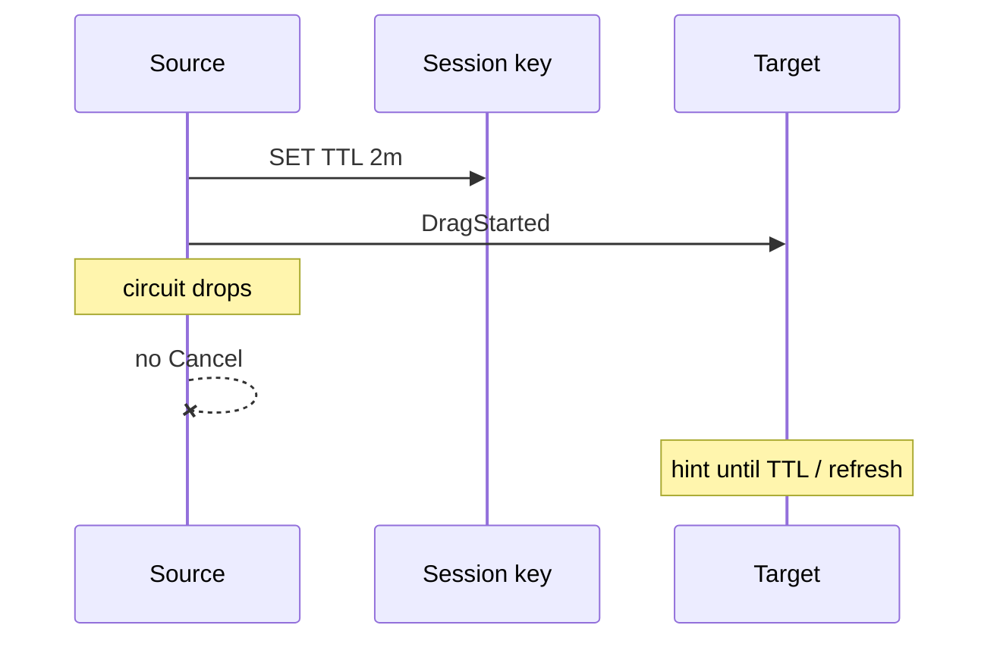

# MvpAspireRedis — implementation

Shared kanban board across **two Blazor replicas** using **Redis** for board JSON, drag sessions, and pub/sub. Same coordinator/UI as `MvpServerSync`; only transport and store change.

**Run:** `dotnet run --project AppHost` (Docker required)  
**URLs:** http://127.0.0.1:5280/board (web-a) · http://127.0.0.1:5281/board (web-b)  
**Quick start:** [README.md](./README.md)

---

## When to use

- Multiple containers; UI host talks to Redis directly.
- Keep `IDragSessionHub` / `IBoardStore` contracts; swap implementations.
- Local proof that window A and B on **different processes** still sync.



---

## What it proves

| Concern | MvpServerSync | MvpAspireRedis |
| --- | --- | --- |
| Board items | In-memory singleton | Redis string `mvp:board:items` |
| Board refresh | Same process event | Pub/sub `mvp:board:changed` |
| Drag events | In-process hub | Pub/sub `mvp:drag:events` |
| Drag session | In-memory dict | Key TTL **2 minutes** |
| Hosting | One process | Redis + **web-a** + **web-b** |

---

## AppHost topology



### Why web-a / web-b (not `WithReplicas(2)`)



Pinned ports force “window 1 → replica A, window 2 → replica B” for demos.

---

## Layers



| Piece | Role |
| --- | --- |
| `RedisDragSessionHub` | Local subscriber map + Redis publish/subscribe |
| `RedisBoardStore` | Authoritative JSON + change channel |
| `DragDropCoordinator` | Unchanged gesture logic |

This is **Redis pub/sub + local fan-out**, not Azure SignalR Service and not a SignalR Redis backplane. The Blazor circuit is still browser ↔ whichever web replica owns it.



---

## Hub fan-out



---

## End-to-end: drag across replicas



---

## Redis contract

| Key / channel | Role |
| --- | --- |
| `mvp:board:items` | Board JSON |
| `mvp:board:changed` | Refresh notify |
| `mvp:drag:events` | Drag envelopes |
| `mvp:drag:session:{id}` | Source circuit id (TTL 2m) |



---

## DI

```csharp
builder.AddRedisClient("redis");

builder.Services.AddSingleton<RedisBoardStore>();
builder.Services.AddSingleton<IBoardStore>(sp => sp.GetRequiredService<RedisBoardStore>());
builder.Services.AddHostedService(sp => sp.GetRequiredService<RedisBoardStore>());

builder.Services.AddSingleton<RedisDragSessionHub>();
builder.Services.AddSingleton<IDragSessionHub>(sp => sp.GetRequiredService<RedisDragSessionHub>());
builder.Services.AddHostedService(sp => sp.GetRequiredService<RedisDragSessionHub>());

builder.Services.AddScoped<DragDropCoordinator>();
```

AppHost: `AddRedis("redis")` + `WithReference(redis)` on web-a / web-b.

---

## Production notes



- Scope keys/channels by tenant/workspace.
- Treat drag sessions as ephemeral (TTL).
- Redis does **not** restore unfinished drags after circuit reconnect.
- Authoritative domain data may move to SQL later; keep “write → notify.”

### Circuit disconnect



---

## File map

| Path | Role |
| --- | --- |
| `AppHost/AppHost.cs` | Redis + web-a / web-b |
| `Web/Infrastructure/RedisKeys.cs` | Key contract |
| `Web/Services/Board/RedisBoardStore.cs` | Board |
| `Web/Services/DragSession/RedisDragSessionHub.cs` | Drag bus |
| `Web/Services/DragDrop/DragDropCoordinator.cs` | Gesture |
| `Web/Components/Pages/Board.razor` | UI |

Index: [../IMPLEMENTATION.md](../IMPLEMENTATION.md) · Compare: [MvpAspirePostgres](../MvpAspirePostgres/IMPLEMENTATION.md)
