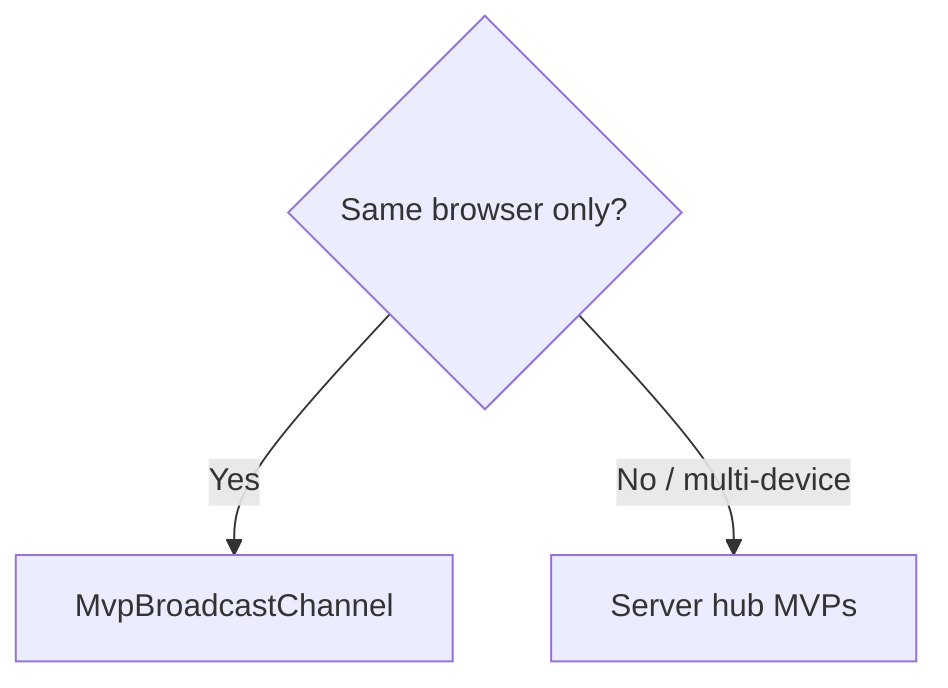
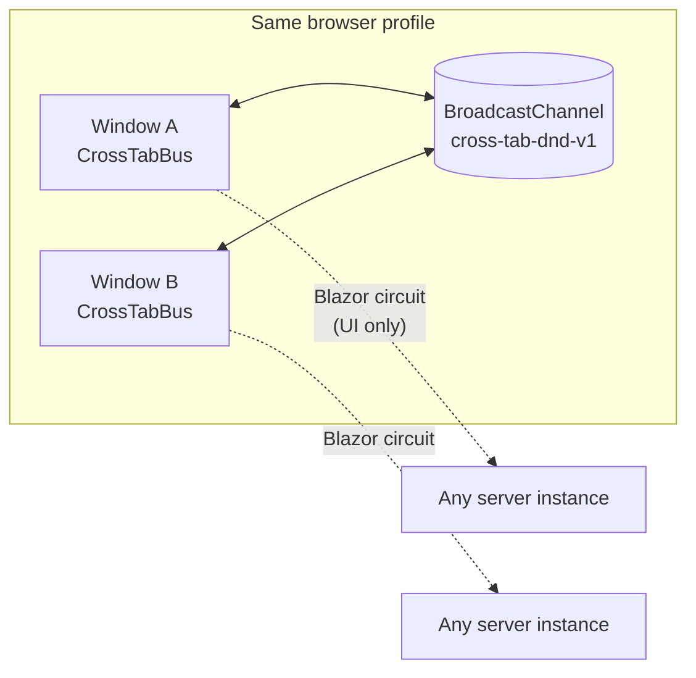
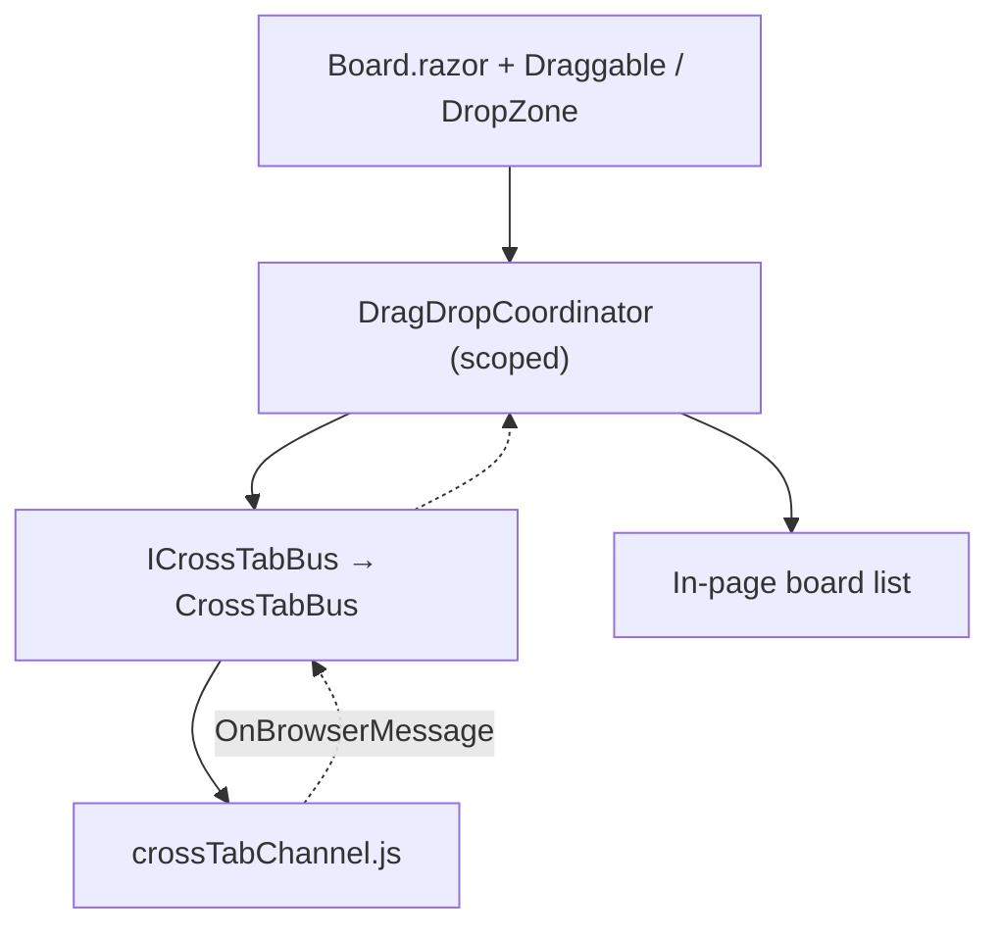
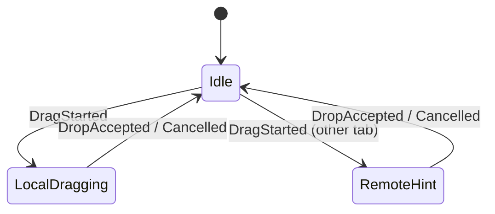
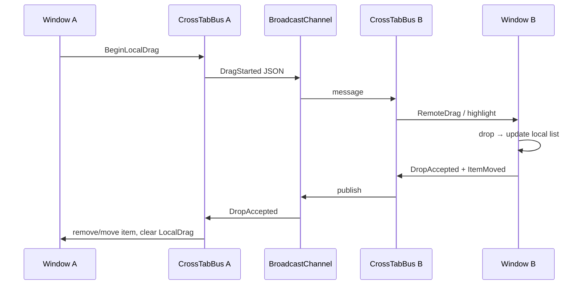
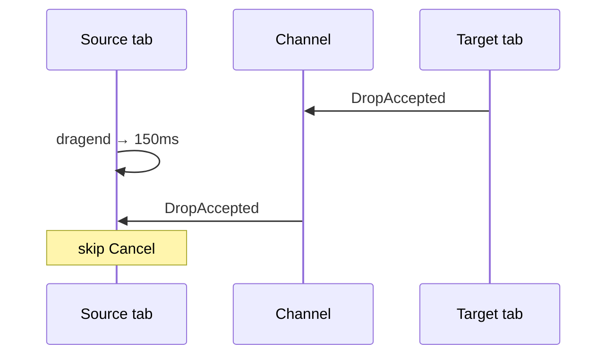
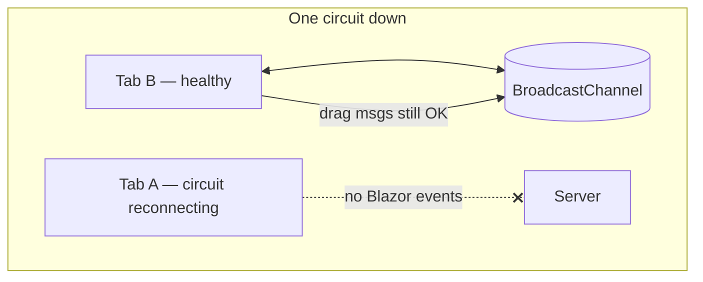

# MvpBroadcastChannel — implementation

Shared **kanban board** where drag signaling stays in the **browser** via `BroadcastChannel` + JSInterop. Each page keeps its own board list and syncs moves with messages.

**Run:** `dotnet run --project MvpBroadcastChannel` → http://localhost:5201/board  
**Constraint:** two side-by-side **windows**, same browser profile.

---

## When to use

- Same browser / profile only (no multi-device drag).
- Minimal latency — no server hop for drag hints.
- Azure scale-out does **not** break drag **signaling** (messages never leave the browser).



---

## Topology



Blazor circuits can land on different containers; drag messages still flow client-side.

---

## Layers



| Piece | Role |
| --- | --- |
| `crossTabChannel.js` | Creates `BroadcastChannel`, `tabId`, publish/subscribe |
| `CrossTabBus` | JSON envelopes; ignores self messages |
| `DragDropCoordinator` | Same gesture protocol as server-hub demos |
| Board list | Per page; `ItemMoved` (or equivalent) keeps lists aligned |

---

## Protocol & state



| Message | Purpose |
| --- | --- |
| DragStarted | Remote hint / enable drop zones |
| DragCancelled | Clear remote hint |
| DropAccepted | Apply move locally on both sides |
| ItemMoved (board sync) | Keep zone membership aligned |

---

## End-to-end sequence



### 150 ms cancel grace

Same as server demos: `dragend` waits briefly so `DropAccepted` can win over `DragCancelled`.



---

## DI & startup

```csharp
builder.Services.AddScoped<ICrossTabBus, CrossTabBus>();
builder.Services.AddScoped<DragDropCoordinator>();
```

Start after first interactive render:

```csharp
protected override async Task OnAfterRenderAsync(bool firstRender)
{
    if (firstRender)
        await Coordinator.StartAsync();
}
```

Copy `wwwroot/js/crossTabChannel.js` when integrating.

---

## Scale-out & disconnect



- **Multi-container:** fine for signaling; persist authoritative data on drop if needed (API).
- **Circuit drop:** browser channel can still deliver between healthy tabs; the down tab cannot participate until reconnect.

---

## File map

| Path | Role |
| --- | --- |
| `Program.cs` | DI |
| `Services/CrossTab/CrossTabBus.cs` | JSInterop bus |
| `wwwroot/js/crossTabChannel.js` | BroadcastChannel |
| `Services/DragDrop/DragDropCoordinator.cs` | Gesture state |
| `Components/Pages/Board.razor` | UI |

See also [../IMPLEMENTATION.md](../IMPLEMENTATION.md) and [MvpCaseSidePanelBroadcast](../MvpCaseSidePanelBroadcast/IMPLEMENTATION.md) (same transport, side-panel domain).
