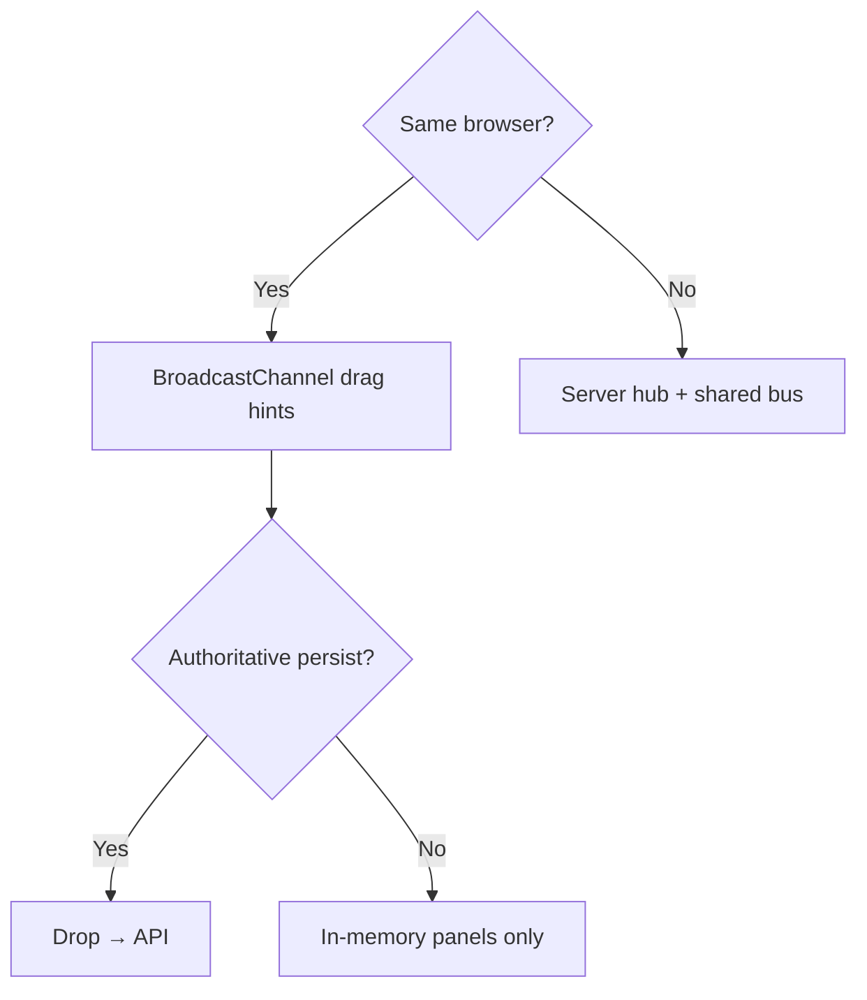
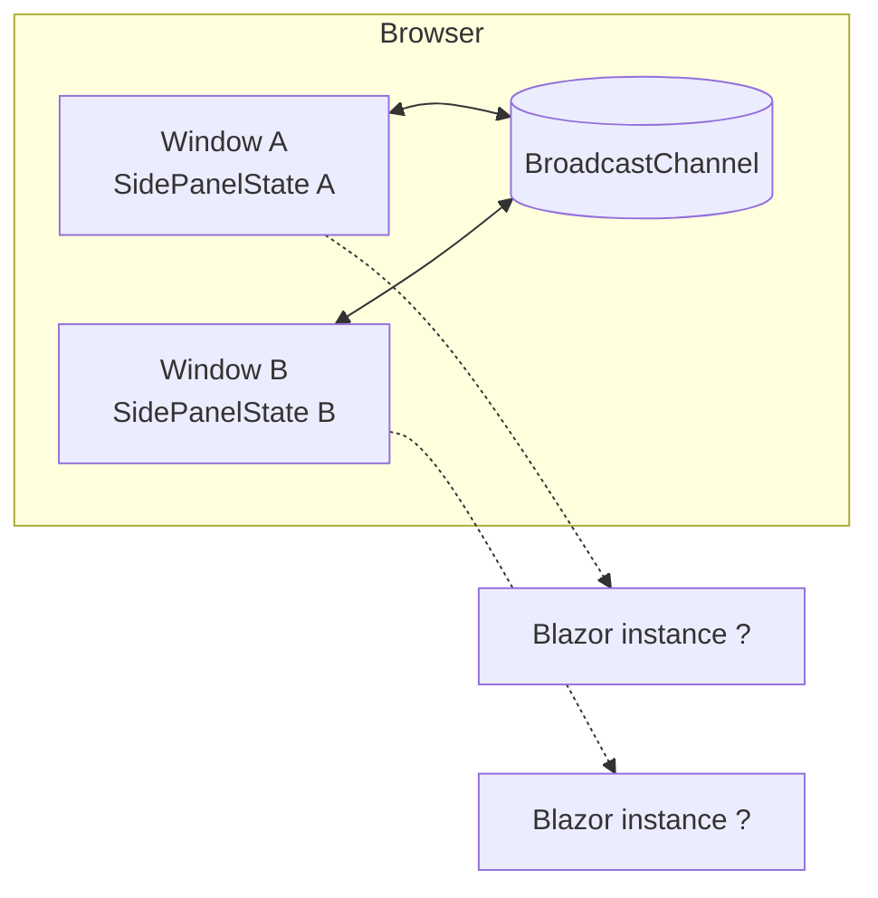
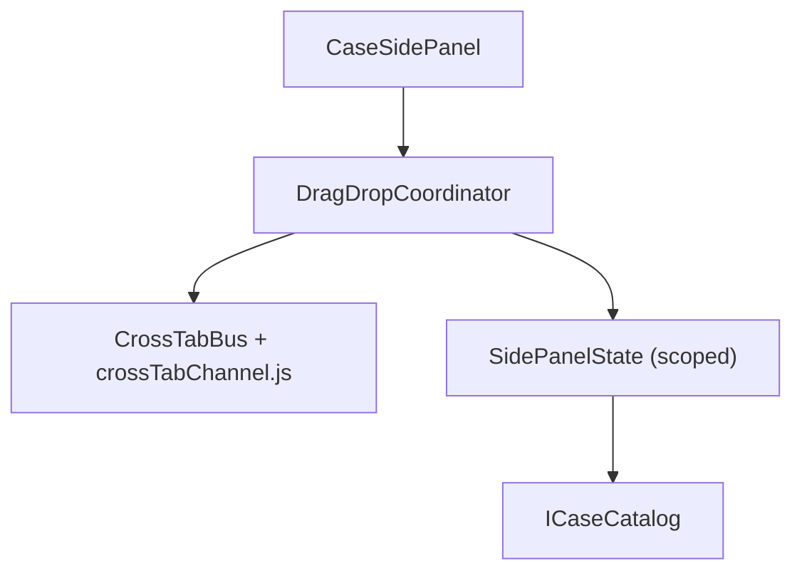
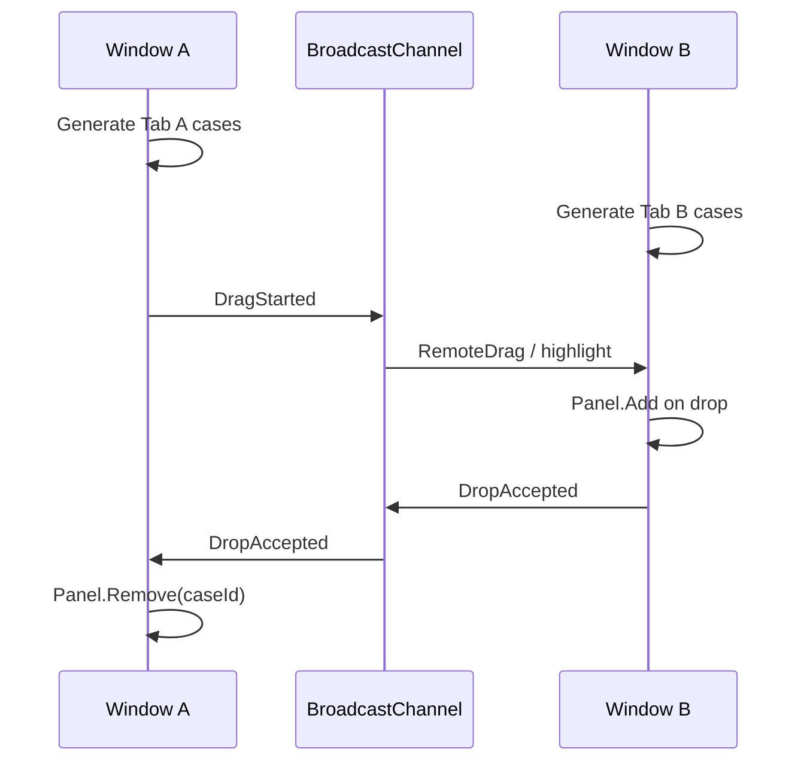
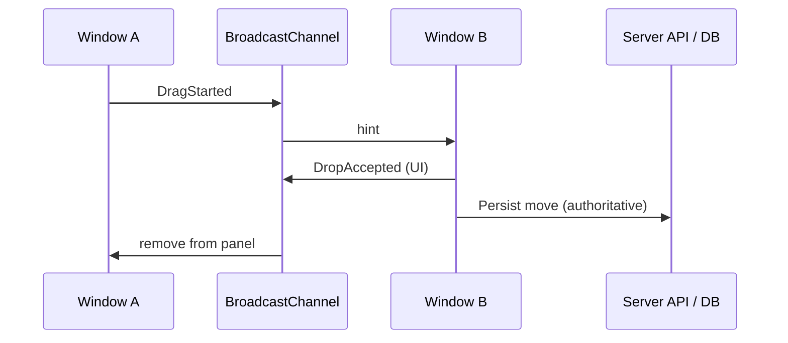
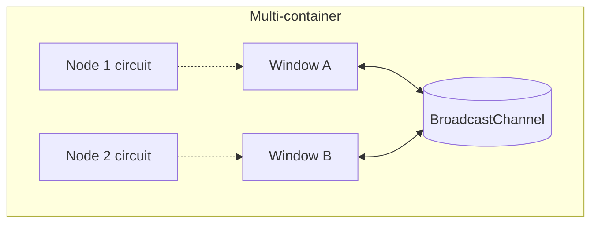

# MvpCaseSidePanelBroadcast — implementation

Same **case side panel** UX as `MvpCaseSidePanelServer`, but drag signaling uses **BroadcastChannel** in the browser instead of an in-process hub.

**Run:** `dotnet run --project MvpCaseSidePanelBroadcast` → http://localhost:5204/  
**Constraint:** two side-by-side **windows**, same browser profile.

---

## When to use

- Side-panel “move case between windows” + same-browser only.
- Multi-container Blazor hosts without distributing a drag hub.
- Often pair with a **server API commit** on drop (hybrid).



---

## Topology



Each window keeps its own `SidePanelState`. Drag messages never need shared server memory.

---

## Layers



| Piece | Lifetime | Role |
| --- | --- | --- |
| `ICrossTabBus` / `CrossTabBus` | Scoped | Browser pub/sub |
| `SidePanelState` | Scoped | This window’s links |
| `DragDropCoordinator` | Scoped | Gesture + 150 ms grace |

---

## End-to-end sequence



### Hybrid production (recommended)



---

## DI & startup

```csharp
builder.Services.AddSingleton<ICaseCatalog, CaseCatalog>();
builder.Services.AddScoped<ICrossTabBus, CrossTabBus>();
builder.Services.AddScoped<SidePanelState>();
builder.Services.AddScoped<DragDropCoordinator>();
```

`await Coordinator.StartAsync()` after first interactive render (needs JSInterop).

---

## Scale-out & reconnect



| Concern | Behavior |
| --- | --- |
| Different Blazor replicas | Drag signaling still works (browser) |
| One circuit reconnecting | Other tab can still send/receive channel messages |
| Multi-device / other browser | Not supported — use server hub |

---

## File map

| Path | Role |
| --- | --- |
| `Program.cs` | DI |
| `Services/CrossTab/*` | Bus |
| `wwwroot/js/crossTabChannel.js` | BroadcastChannel |
| `Services/SidePanel/SidePanelState.cs` | Per-window list |
| `Components/SidePanel/CaseSidePanel.razor` | UI |

Compare: [MvpCaseSidePanelServer](../MvpCaseSidePanelServer/IMPLEMENTATION.md), [MvpBroadcastChannel](../MvpBroadcastChannel/IMPLEMENTATION.md). Index: [../IMPLEMENTATION.md](../IMPLEMENTATION.md).
