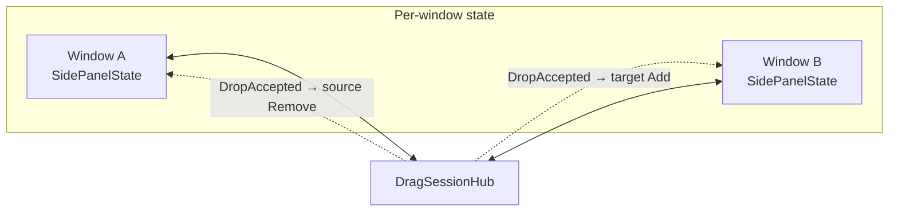
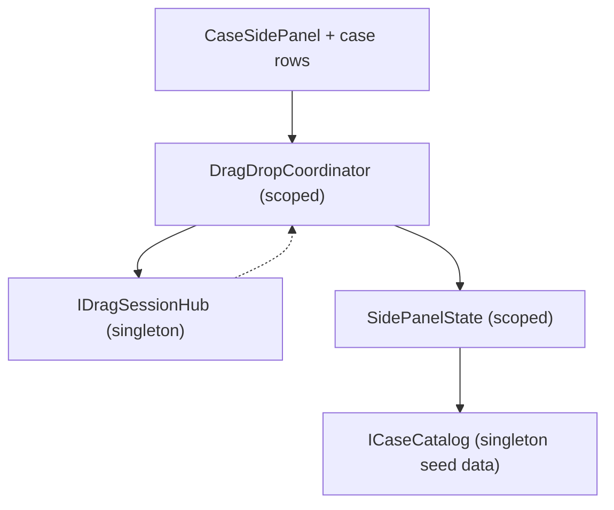
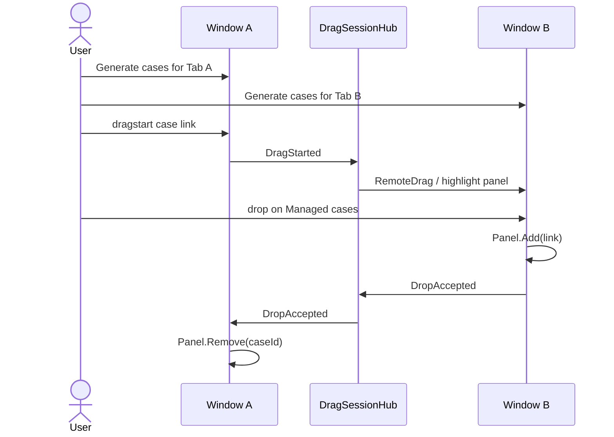
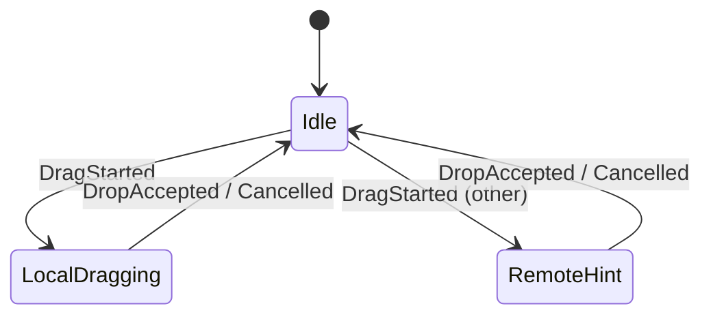
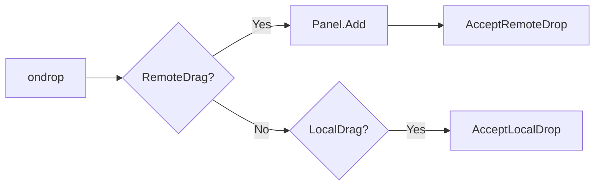
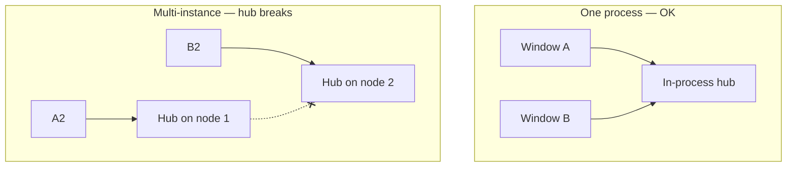
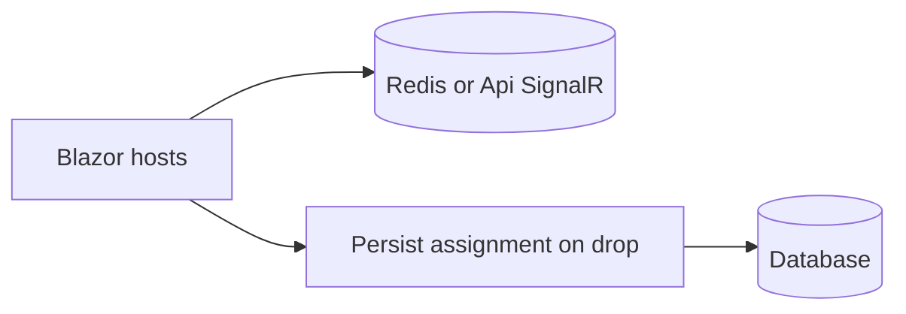

# MvpCaseSidePanelServer — implementation

**Case-management** style MVP: each window has its **own** managed-cases side panel. Drag **moves** a case link from one panel to the other via an in-process `DragSessionHub`.

**Run:** `dotnet run --project MvpCaseSidePanelServer` → http://localhost:5203/  
**Constraint:** two side-by-side **windows**.

---

## When to use

- Each window owns a working set (not one shared board list).
- Pure C# server hub.
- Closest template for “drag a case into the other window’s panel.”



Contrast with board demos: board = one shared store; side panel = **scoped** lists + move semantics.

---

## Layers



| Piece | Lifetime | Role |
| --- | --- | --- |
| `SidePanelState` | Scoped | Links visible in **this** window |
| `DragDropCoordinator` | Scoped | Local/Remote drag + 150 ms grace |
| `DragSessionHub` | Singleton | Cross-circuit events (one process) |
| `ICaseCatalog` | Singleton | Demo datasets (Tab A / Tab B) |

---

## Demo flow





---

## Wiring the panel

```csharp
builder.Services.AddSingleton<ICaseCatalog, CaseCatalog>();
builder.Services.AddSingleton<IDragSessionHub, DragSessionHub>();
builder.Services.AddScoped<SidePanelState>();
builder.Services.AddScoped<DragDropCoordinator>();
```

In `CaseSidePanel.razor`:

- `Coordinator.Dispatcher = InvokeAsync`
- Subscribe `Changed` + `LinkRemovedRemotely` / `ItemRemovedRemotely`
- Drop: `RemoteDrag` → `Panel.Add` + `AcceptRemoteDropAsync`; `LocalDrag` → `AcceptLocalDropAsync`
- On remote accept for a link you owned → `Panel.Remove`



---

## Scale-out



- Panel state stays scoped (correct).
- Only **drag transport** must be distributed (Redis / Postgres API) **or** switch to BroadcastChannel + API on drop.

Production sketch:



See [MvpAspireRedis](../MvpAspireRedis/IMPLEMENTATION.md), [MvpAspirePostgres](../MvpAspirePostgres/IMPLEMENTATION.md), or [MvpCaseSidePanelBroadcast](../MvpCaseSidePanelBroadcast/IMPLEMENTATION.md).

---

## File map

| Path | Role |
| --- | --- |
| `Program.cs` | DI |
| `Services/DragSession/*` | Hub |
| `Services/DragDrop/DragDropCoordinator.cs` | Gesture |
| `Services/SidePanel/SidePanelState.cs` | Per-window list |
| `Components/SidePanel/CaseSidePanel.razor` | Drop target UI |
| `Services/Cases/*` | Demo catalog |

See [../IMPLEMENTATION.md](../IMPLEMENTATION.md).
