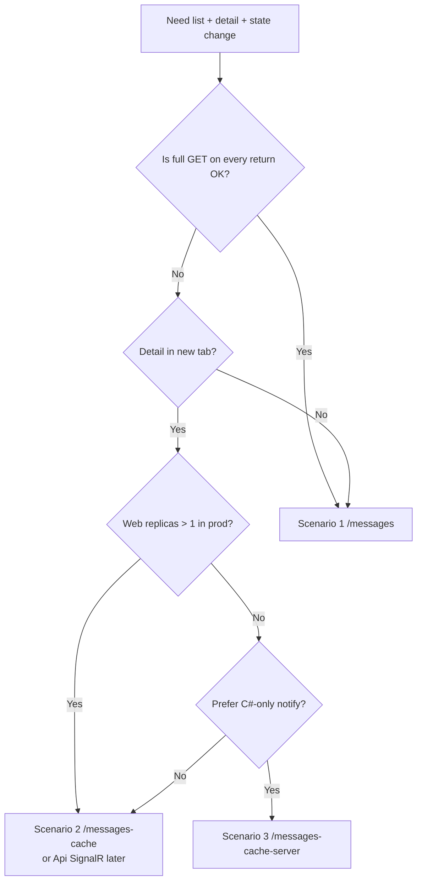

# Messages MVP — three scenarios compared

This document summarizes the three routes in **MvpDockerMessages**: what each one demonstrates, when to prefer it, and tradeoffs we discussed while building and reviewing them. It complements [README.md](./README.md) (how to run) and [IMPLEMENTATION.md](./IMPLEMENTATION.md) (sequences and file map).

All scenarios share the same **Api** (`GET` list, `GET` detail, `PUT` state). The difference is **how the Blazor overview stays in sync** after the user edits a message.

```text
                    ┌─────────────────────────────────────┐
                    │           Messages Api              │
                    │  (source of truth on Save / load)   │
                    └─────────────────────────────────────┘
                                      ▲
                                      │ HTTP
          ┌───────────────────────────┼───────────────────────────┐
          │                           │                           │
   /messages                   /messages-cache          /messages-cache-server
   full reload                 cache + BC                 cache + C# bus
```

## At a glance

| | **Scenario 1** | **Scenario 2** | **Scenario 3** |
| --- | --- | --- | --- |
| **Route** | `/messages` | `/messages-cache` | `/messages-cache-server` |
| **Detail UX** | Same browser tab | New browser tab | New browser tab |
| **List on overview** | No cache; refetch every remount | Circuit-scoped cache | Circuit-scoped cache |
| **Live update after Save** | Only after user returns (full `GET`) | `BroadcastChannel` (browser) | `MessagesServerSyncBus` (Web process) |
| **Primary language** | C# only | C# + JS interop | C# (JS only for `window.close`) |
| **Notify needs Azure extra?** | No | No | No (single Web node) |
| **Multi Web replica (prod)** | Reload always correct from Api | BC: same browser OK | In-process bus: **not guaranteed** |

States: `Waiting` (UI: “In waiting”), `Processed`, `Deleted`.

---

## Scenario 1 — `/messages` (full list reload)

**Intent:** Baseline “expensive list” behavior — every time the overview is shown again, reload the entire inbox from the Api.

### Flow

1. User opens `/messages` → `OnInitializedAsync` → `GET /api/messages`.
2. User clicks a row → navigates to detail **in the same tab** → overview component is **disposed**.
3. User changes state on detail (immediate `PUT` per button in this route).
4. User returns via browser **Back** or **Back to overview** → **new** overview instance → `OnInitializedAsync` again → full `GET /api/messages`.

### Why browser Back “refreshes” the list

Leaving `/messages` destroys that component instance and its in-memory `_messages`. Back navigation creates a **new** instance, which always runs `OnInitializedAsync` and hits the Api again. The updated state appears because **Save already wrote to the Api**, not because the old overview remembered anything.

### Advantages

- **Simplest mental model** — overview always matches Api on every visit.
- **No cross-tab / cross-circuit sync** to design or debug.
- **Works with multiple Web replicas** for “fresh load” (each `GET` goes to Api; sticky circuits don’t matter for reload).
- **Pure C#** on the notify path (there is no live notify; only HTTP).

### Inconveniences

- **Cost of full list** on every return (network + server work). If that becomes a problem, scenarios 2 and 3 exist to avoid refetching the whole list when only one row changed.
- **Same-tab detail** — user loses the overview context unless they use Back (unlike new-tab flows).
- **No live badge update** on an overview that stayed open elsewhere (N/A here because overview is disposed in same-tab navigation).

### When to use

- Default pattern when list load is cheap enough or correctness-by-refetch is preferred.
- Reference for comparing cache + push approaches.

---

## Scenario 2 — `/messages-cache` (cache + new tab + BroadcastChannel)

**Intent:** Keep the overview mounted in tab A; open detail in tab B; on **Save**, persist to Api, **patch one row** on the overview without `GET /api/messages`, then try to close the detail tab. **Cancel** closes without Api write or broadcast.

### Flow

1. Tab A: `/messages-cache` loads list once into `MessagesListCache` (scoped to **that Blazor circuit**).
2. Row link uses `target="_blank"` → tab B: new circuit, new scoped cache (detail loads one message via `GET`).
3. **Save:** `PUT` Api → serialize updated DTO → `BroadcastChannel` → tab A deserializes → `Cache.Apply` → UI updates.
4. **Cancel:** `window.close()` only.

### Advantages

- **Avoids full list reload** on the overview when detail saves (patch only).
- **Overview stays visible** while editing in another tab.
- **No Azure-hosted notify service** — communication is **local to the user’s browser** (same origin, same browser profile).
- **Reliable for one user, two tabs** even when **Web is scaled to many replicas**, because notify never crosses server instances; it crosses tabs in the browser. Overview circuit on replica A and detail on replica B is fine: BC doesn’t care which Web node owns each circuit.
- **Save still updates everyone who loads later** — `PUT` updates the Api; anyone who opens or reloads the page gets fresh data from `GET`. Live push is only for **already-open** overview tabs in that browser.

### Inconveniences

- **JSON + JS interop** — `MessageDto` is serialized in C#, sent through JS `BroadcastChannel`, deserialized back (`MessagesCacheTabBus`). Extra contract surface (camelCase, enums, dates). For one small DTO on Save this is negligible; it hurts more with large or frequent payloads. (Pure JS could use structured clone; Blazor’s bridge pushes you toward strings/JSON.)
- **Same browser only** — other users, other machines, or another browser profile do **not** receive the live patch (they still see updates on next load from Api).
- **Depends on JS** for notify and tab close (`messagesCacheChannel.js`).
- **`window.close()`** may be blocked; overview patch still applies if Save succeeded.

### When to use

- Multi-tab UX with **cheap optimistic overview** without refetching the whole list.
- Production **multi-replica Web** where you want **this user’s** overview tab to update live without standing up server push yet.

---

## Scenario 3 — `/messages-cache-server` (cache + new tab + C# in-process bus)

**Intent:** Same UX as scenario 2, but **notify is server-side C#**: singleton `MessagesServerSyncBus` (same idea as `MvpServerSync`’s in-process drag hub) fans out to all **subscribed circuits on this Web process**. No `BroadcastChannel`.

### Flow

1. Overview subscribes to `MessagesServerSyncBus` on init; list lives in circuit-scoped `MessagesListCache`.
2. Detail in new tab: Save → `PUT` Api → `ServerBus.PublishAsync(dto)` → handlers on **this Web instance** patch caches → `TabCloser` / `window.close()`.

### Advantages

- **No JSON over BroadcastChannel** for notify — `MessageDto` stays in-process between circuits on the same node.
- **More C#-oriented** — easier to test and extend in .NET; JS only for closing the tab.
- **Can update any subscribed overview on the same Web instance** — not limited to one browser (e.g. two users both on overview on the same replica could both patch; rare but possible).
- **No extra Azure component** for notify on a **single Web replica** deployment.

### Inconveniences

- **Does not survive Web scale-out** — each replica has its **own** in-memory subscriber list. Overview on **Web A** and detail on **Web B** (common when opening a new tab hits the load balancer) → Save runs `PublishAsync` on **B** → overview on **A** **does not** update live. **Persisted state is still correct** via `PUT`; only the live patch fails.
- **Not “for sure” in production multi-replica** without a **backplane** (Redis, Azure SignalR service, Api hub + SignalR client on each Web replica — see [MvpAspirePostgres](../MvpAspirePostgres/IMPLEMENTATION.md)).
- Same **`window.close()`** caveats as scenario 2.

### When to use

- Single Web instance, local Docker Compose, or environments where all circuits land on one node.
- Teaching **in-process pub/sub** before graduating to Api-driven SignalR for real Azure scale.

---

## Cross-cutting topics (from review discussions)

### Source of truth vs live UI

| Mechanism | What it updates |
| --- | --- |
| **`PUT /api/messages/{id}/state`** | Api store — anyone who **loads or reloads** sees new state |
| **BroadcastChannel / server bus** | **Already open** overview UIs only — optimistic patch, no full list GET |

BroadcastChannel and the server bus are **not** a replacement for the Api. They are **UI sync shortcuts**.

### If full list reload is too expensive (scenario 1)

Options we outlined (scenarios 2–3 implement two of them):

- Circuit-scoped cache + patch one row on Save.
- Conditional fetch (ETag, slim list DTO, pagination).
- Server push (SignalR from Api) for multi-replica and multi-user live updates.

### PWA / installed app

Installing as a PWA does **not** fix Blazor Server offline or cross-replica bus limits by itself. Useful additions:

- **IndexedDB** as a shared client cache across app windows.
- **Background Sync** for queued Save when offline.
- Standalone windows on desktop for overview + detail.

BroadcastChannel still works same-origin in an installed PWA. Server bus rules unchanged.

### Azure: multi-replica, microservices, environments

- **Environments** (dev / staging / prod) are separate deployments; users don’t “hop” environments mid-session.
- **Api scale-out** with shared database: **Save is reliable** across Api replicas.
- **Web scale-out**: each Blazor circuit sticks to **one** Web instance for its lifetime; a **new tab** may start a **new** circuit on a **different** instance.
- **Scenario 2 (BC):** live overview update for **this user** remains viable with many Web replicas.
- **Scenario 3 (bus):** live overview update is **only reliable on one Web node** unless you add cross-node push.

For company-wide live lists (many users, many replicas), the direction aligned with this repo is **Api owns events → SignalR (or similar) → every Web replica** — not an in-process singleton on Web.

### Serialization: BroadcastChannel vs C# bus

| Path | Serialization |
| --- | --- |
| Scenario 2 | JSON (C# ↔ JS ↔ C#) |
| Scenario 3 | None between circuits on same process |
| Future Api SignalR | JSON (or MessagePack) on the wire, shared contract with Api |

Scenario 2’s JSON cost is usually small for one message row; the bigger tradeoff is **browser-only reach** vs **server-side** design.

---

## Decision guide



**Rule of thumb**

- **Correctness by refetch** → scenario 1.
- **Same user, new tab, scaled Web, no extra Azure notify** → scenario 2.
- **Single Web node, all C# in-process** → scenario 3.
- **Many users / many Web replicas / production** → keep scenario 1 or 2 for UX experiments; plan **Api push to all Web replicas** (Postgres MVP pattern) for guaranteed live sync.

---

## Related code

| Scenario | Overview | Detail | Sync |
| --- | --- | --- | --- |
| 1 | `Web/Components/Pages/Messages.razor` | `MessageDetail.razor` | — (HTTP only) |
| 2 | `MessagesCache.razor` | `MessageCacheDetail.razor` | `MessagesCacheTabBus`, `messagesCacheChannel.js` |
| 3 | `MessagesCacheServer.razor` | `MessageCacheServerDetail.razor` | `MessagesServerSyncBus`, `TabCloser` |

Shared: `MessagesListCache`, `MessagesApiClient`, `Api/Services/MessageStore.cs`.

---

## Possible “scenario 4” (not implemented here)

Align with **MvpAspirePostgres**: after `PUT`, **Api** publishes `MessageUpdated` on SignalR; each **Web replica** maintains a connection and patches local caches or triggers UI refresh. That gives **live overview updates across replicas and users** with one extra concern: SignalR backplane if **Api** itself scales out.

See [MvpAspirePostgres/README.md](../MvpAspirePostgres/README.md) and [AZURE-COST-ESTIMATE.md](../MvpAspirePostgres/AZURE-COST-ESTIMATE.md) for hub-on-Api vs Azure SignalR tradeoffs.
