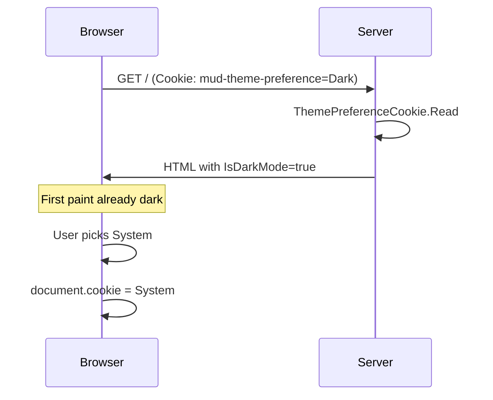

# MudBlazor Dark Mode — Cookie (recommended)

Blazor Server + MudBlazor **Light / Dark / System** theming with an HTTP cookie so the preference is available during prerender. First paint matches the saved mode — no light→dark flash on refresh.

```bash
dotnet run --project MvpMudDarkModeCookie
# http://localhost:5210
```

## Why cookies

| Approach | Readable on server prerender? | FOUC on refresh |
| --- | --- | --- |
| **Cookie** (this MVP) | Yes — `Request.Cookies` | No |
| LocalStorage (`MvpMudDarkModeLocalStorage`) | No — needs JS after first render | Yes |

Blazor Server cannot call `localStorage` in `OnInitialized` during prerender. Cookies arrive with the HTTP request, so `ThemeService` can bind `MudThemeProvider.IsDarkMode` before HTML is sent.

## Flow



## Behavior

- **Light / Dark**: force mode; `ObserveSystemDarkModeChange = false`
- **System**: resolve via `GetSystemPreference()` / `WatchSystemDarkModeAsync`; live OS changes apply
- Early `<head>` script also sets `background-color` when cookie is Dark (or System + OS dark) so the shell is dark before Mud CSS hydrates
- Preference written with `mudThemeCookie.set` (JS) so the next full load still has the cookie (response cookies are unreliable after the Blazor circuit starts)

## File map

| Path | Role |
| --- | --- |
| `Services/ThemePreferenceCookie.cs` | Read cookie from `HttpContext`; write via JS |
| `Services/ThemeService.cs` | Preference + resolved `IsDarkMode` + `Changed` |
| `Services/AppTheme.cs` | Shared light/dark `MudTheme` palettes |
| `Components/Theme/ThemeToggle.razor` | Light \| Dark \| System control |
| `Components/Layout/MainLayout.razor` | `MudThemeProvider` + AppBar |
| `wwwroot/js/theme-cookie.js` | Cookie writer |

## Compare with

[`MvpMudDarkModeLocalStorage`](../MvpMudDarkModeLocalStorage/) — same UI, localStorage persistence, intentional FOUC.
