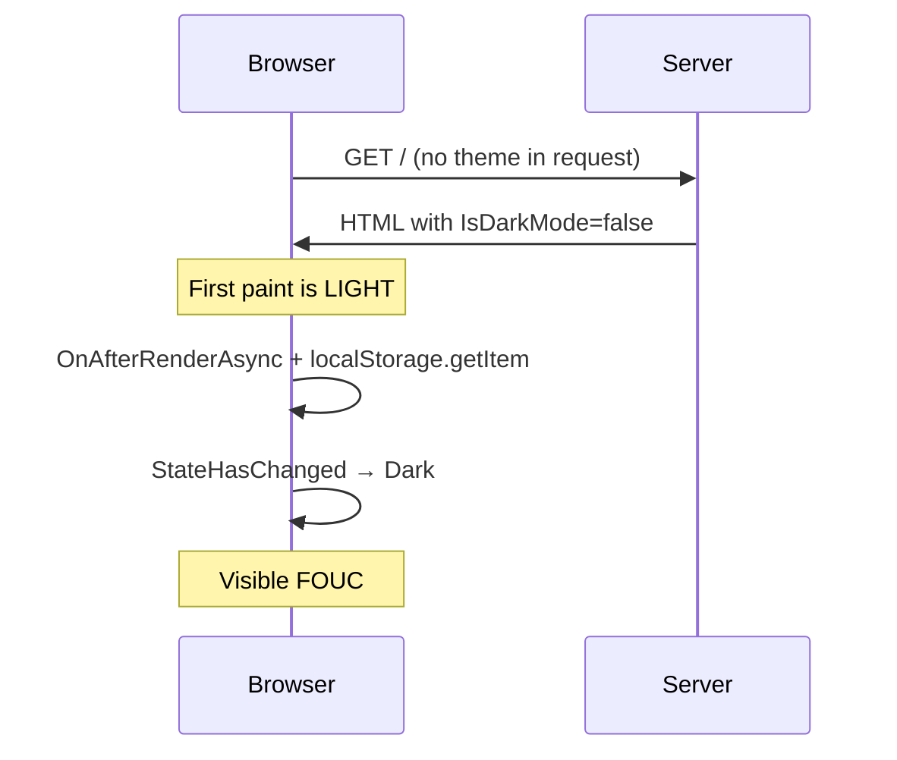

# MudBlazor Dark Mode — LocalStorage (anti-pattern demo)

Same MudBlazor **Light / Dark / System** UX as the cookie MVP, but preference lives in `localStorage`. On Blazor Server that means JS interop only after the first render — so a hard refresh flashes the default (light) theme before the real preference applies.

```bash
dotnet run --project MvpMudDarkModeLocalStorage
# http://localhost:5211
```

## Why this flashes



`localStorage` is not on the HTTP request. Prerender / `OnInitialized` cannot read it without JS, and JS is unavailable until the circuit is interactive.

## Behavior

- Default first paint: light (System unresolved)
- After `HydrateFromLocalStorageAsync`: preference applied; System uses `GetSystemDarkModeAsync` + watch
- AppBar tinted **error/red** so you can tell this MVP apart from the cookie one at a glance
- No early `<head>` theme script — FOUC is intentional

## File map

| Path | Role |
| --- | --- |
| `Services/ThemePreferenceLocalStorage.cs` | Read/write via `mudThemeLocalStorage` JS |
| `Services/ThemeService.cs` | Preference + `IsHydrated` gate |
| `Components/Layout/MainLayout.razor` | Hydrates in `OnAfterRenderAsync(firstRender)` |
| `wwwroot/js/theme-localstorage.js` | `localStorage` helpers |

## Compare with

[`MvpMudDarkModeCookie`](../MvpMudDarkModeCookie/) — recommended cookie approach with no FOUC.
