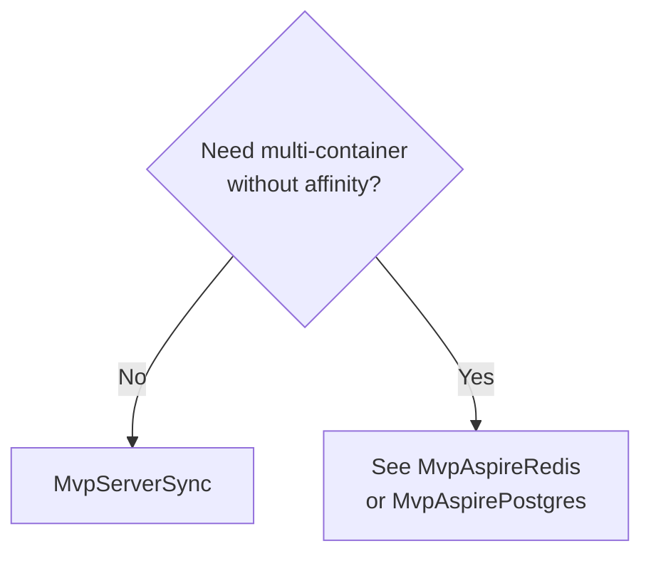
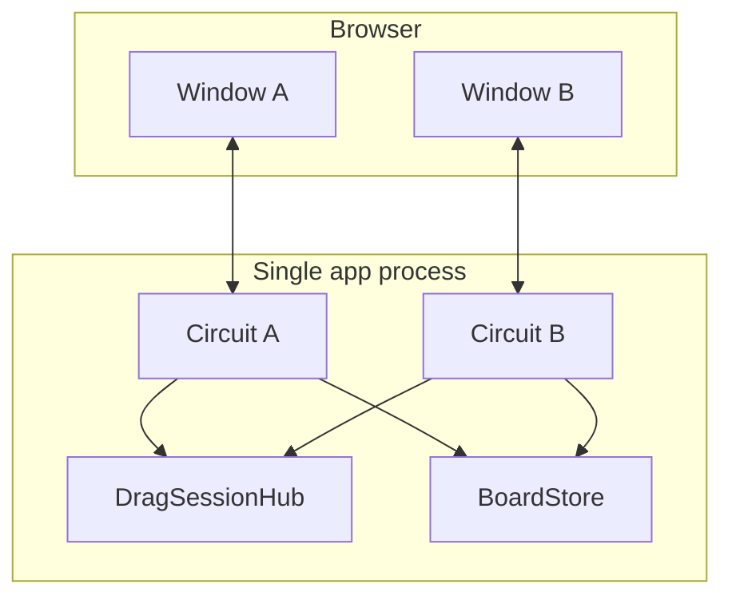
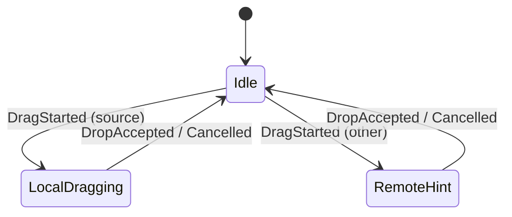
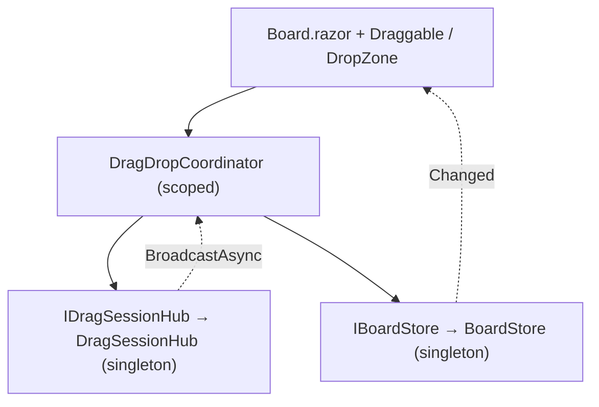
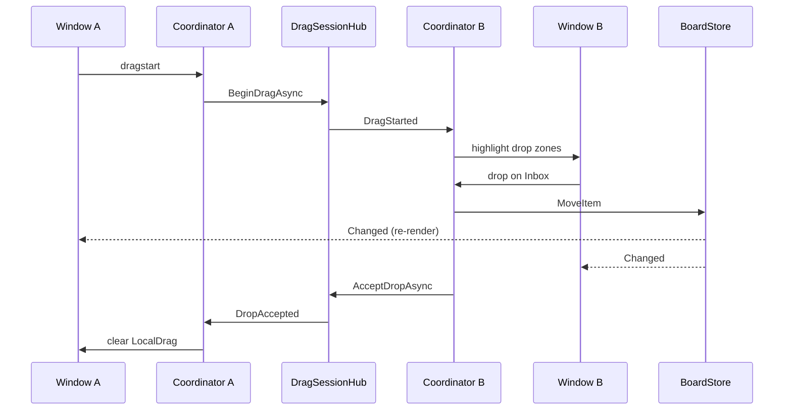
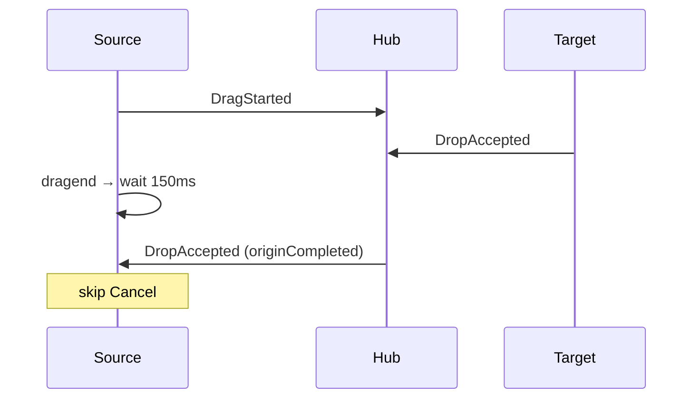
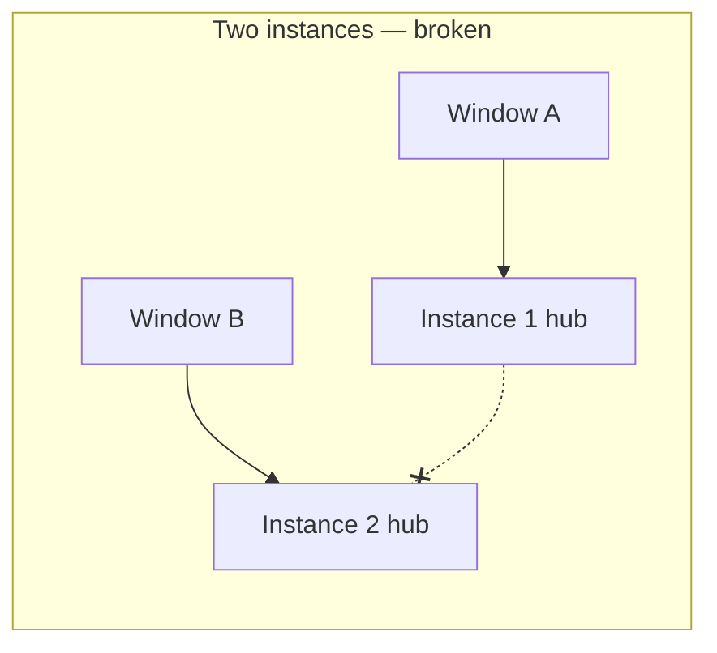

# MvpServerSync — implementation

In-process server hub for a **shared kanban board**. Both browser windows talk to **one** Blazor Server process; drag events and board state live in memory.

**Run:** `dotnet run --project MvpServerSync` → http://localhost:5202/board  
**Constraint:** two side-by-side **windows** (not tabs).

---

## When to use

- Single app instance (or sticky sessions to one instance).
- Pure C# — no JSInterop for drag signaling.
- Starting point before Redis / API scale-out.



---

## Problem & protocol

Each window has its own Blazor circuit. Nothing shares drag state by default.



| Message | Meaning |
| --- | --- |
| DragStarted | Other windows show remote-drag UI |
| DragCancelled | Clear remote hint (no valid drop) |
| DropAccepted | Target applied move; source clears local drag |



---

## Layers



| Piece | Lifetime | Role |
| --- | --- | --- |
| `DragDropCoordinator` | Scoped (per circuit) | `LocalDrag` / `RemoteDrag`, 150 ms cancel grace |
| `DragSessionHub` | Singleton | In-process pub/sub |
| `BoardStore` | Singleton | Shared box list + zones |

---

## End-to-end sequence



### Cancel vs drop race



---

## DI (`Program.cs`)

```csharp
builder.Services.AddSingleton<IBoardStore, BoardStore>();
builder.Services.AddSingleton<IDragSessionHub, DragSessionHub>();
builder.Services.AddScoped<DragDropCoordinator>();
```

Wire the page:

```csharp
Coordinator.Dispatcher = InvokeAsync;
Coordinator.Start();
Coordinator.Changed += () => InvokeAsync(StateHasChanged);
```

---

## Scale-out limit



In-process hub + singleton store **do not** cross containers. Next steps: [MvpAspireRedis](../MvpAspireRedis/IMPLEMENTATION.md) or [MvpAspirePostgres](../MvpAspirePostgres/IMPLEMENTATION.md).

---

## File map

| Path | Role |
| --- | --- |
| `Program.cs` | DI |
| `Services/DragSession/DragSessionHub.cs` | Transport |
| `Services/DragDrop/DragDropCoordinator.cs` | Per-circuit gesture state |
| `Services/Board/BoardStore.cs` | Shared board |
| `Components/Pages/Board.razor` | UI |
| `Components/DragDrop/*` | Draggable / DropZone |

See also [../IMPLEMENTATION.md](../IMPLEMENTATION.md) (index) and [../README.md](../README.md).
